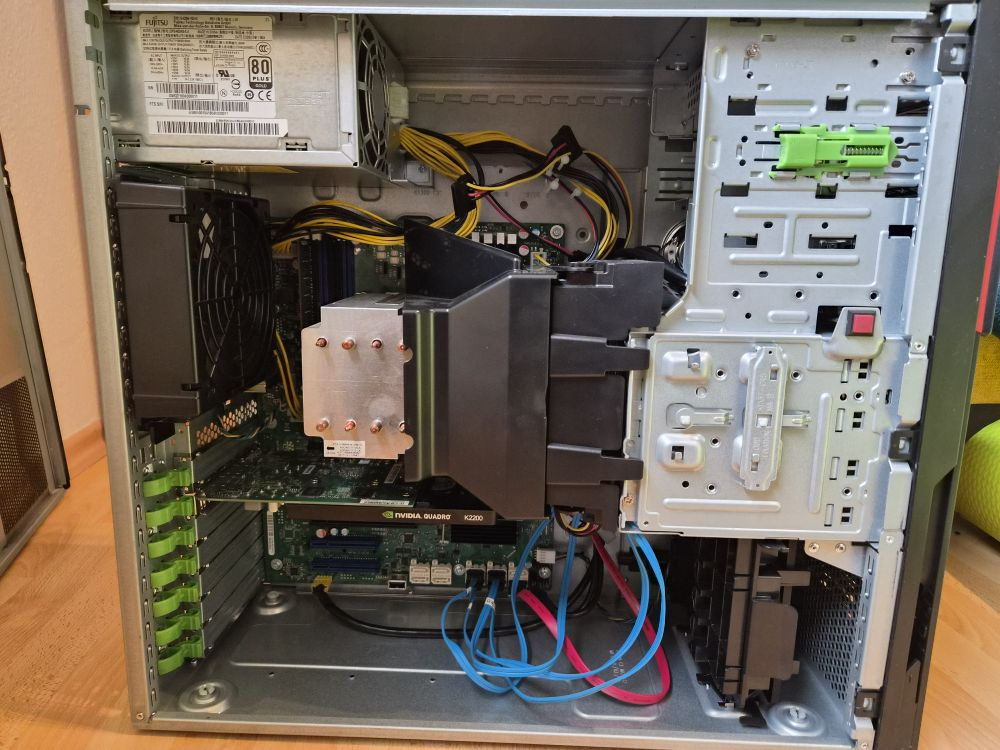
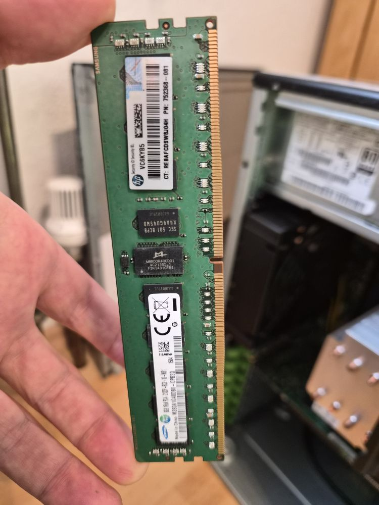
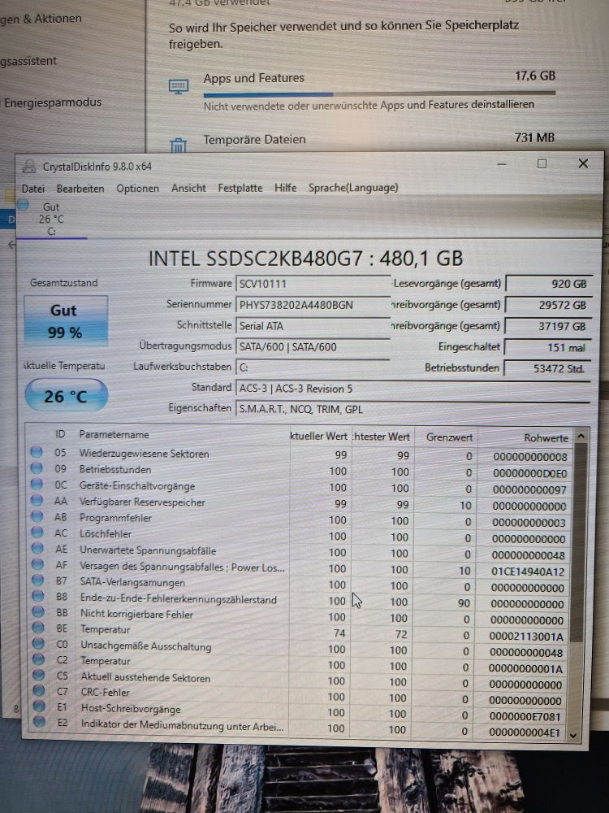
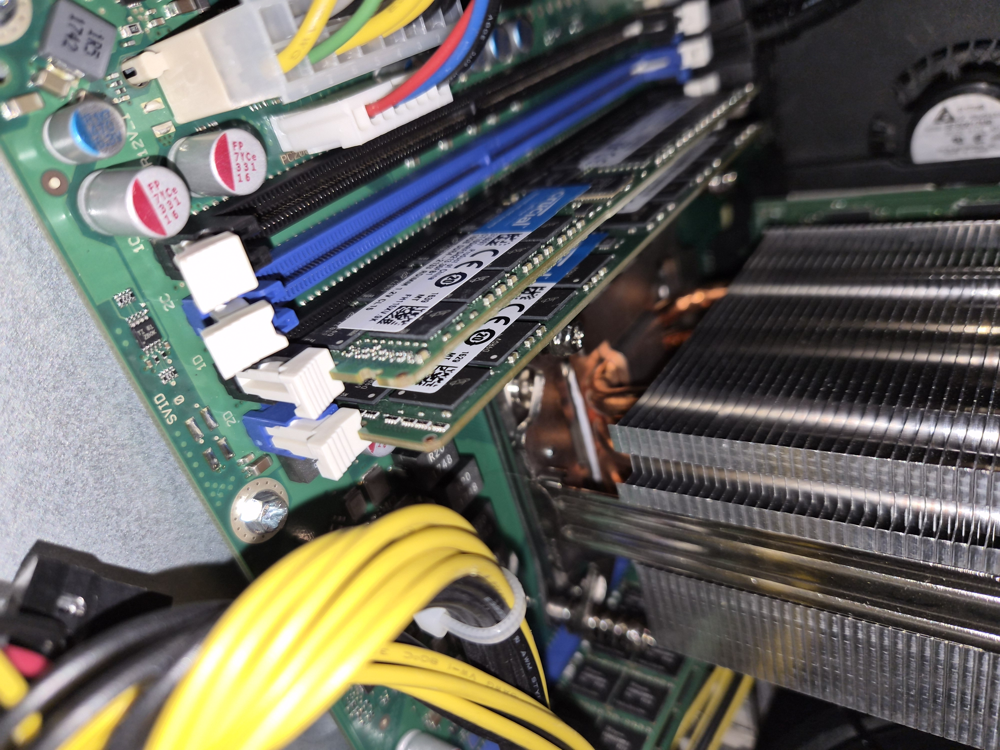
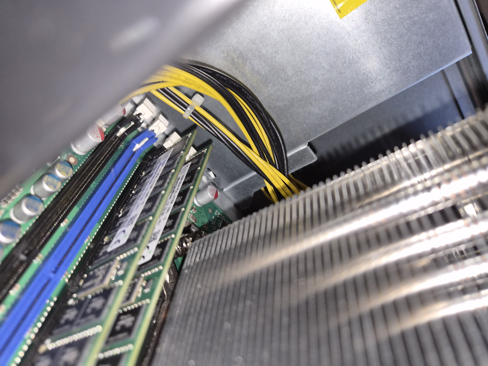
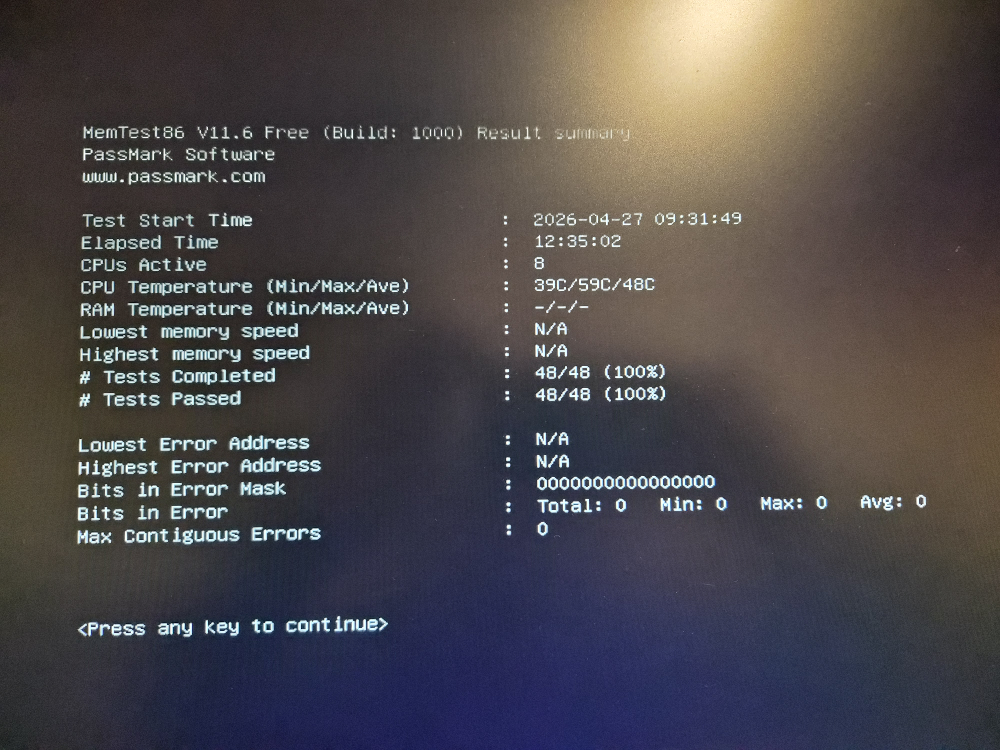

# PHASE_0 – Vorbereitung
**Status: ✅ COMPLETE**
**Zeitraum:** 2026-04 | **Aufwand:** ~6h (inkl. 1.5h Memtest)

---

## Schritte
- ✅ Projektdokumente erstellt (SSoT, Deployment-Reihenfolge, Anforderungen)
- ✅ Hardware-Inventur abgeschlossen
- ✅ KI-Toolchain eingerichtet (Claude Pro + Project, Custom Instructions)
- ✅ RAM-Module empfangen (4x16GB ECC DDR4, 157€)
- ✅ RAM installiert (Dual-Channel B+D)
- ✅ BIOS: 64GB erkannt, 2133MHz
- ✅ Ubuntu 24.04 LTS ISO heruntergeladen (~2GB)
- ✅ Rufus konfiguriert (GPT, UEFI, FAT32)
- ✅ Memtest86 USB erstellt (imageUSB.exe)
- ✅ Memtest86 Pass 0: NULL FEHLER (64GB stabil)

---

## Konfigurationen

### Hardware (Hauptserver)
- **Gerät:** Fujitsu Celsius M740b
- **CPU:** Xeon E5-2620 v4 (8C/16T)
- **RAM:** 64GB ECC DDR4 (4x16GB) – 2x SK Hynix RA0, 1x Crucial RB0, 1x Crucial RBB
- **RAM-Modus:** Dual-Channel B+D, 2133MHz
- **GPU:** Quadro K2200 (4GB VRAM)
- **Storage:** 480GB SSD (99% Health, CrystalDiskInfo)
- **Memtest86:** Pass 0 – NULL Fehler

---

## Dokumentation

### Server-Innenraum (Ausgangszustand)

### Originaler RAM-Riegel (1x 8GB, ausgebaut)

### SSD-Zustand vor Installation

### Neue RAM-Riegel eingebaut

### Memtest86 – Ergebnis

---

## Lessons Learned

### Hardware & Vorbereitung
- ✅ Systematische Dokumentation (Screenshots, BIOS-Checks) zahlt sich später aus
- ✅ Memtest validiert Stabilität trotz gemischter RAM-Revisionen
- ⚠️ eBay-Risiko: Immer RAM-Revisionen VOR dem Kauf prüfen
- ⚠️ ZIP-Archive IMMER entpacken vor Installer-Ausführung
