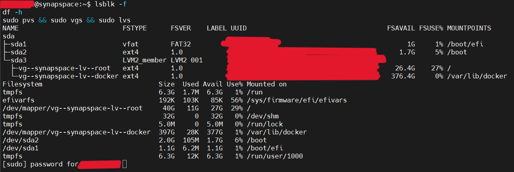
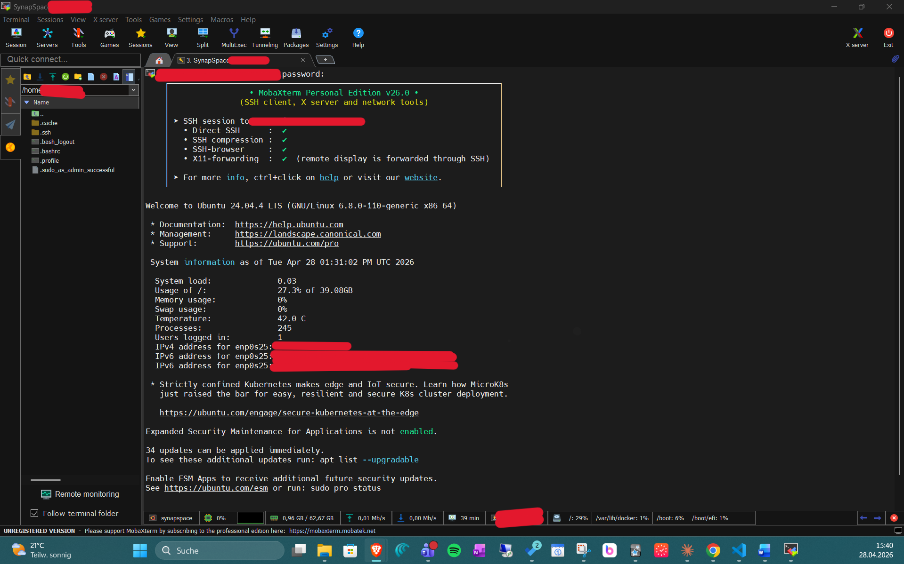
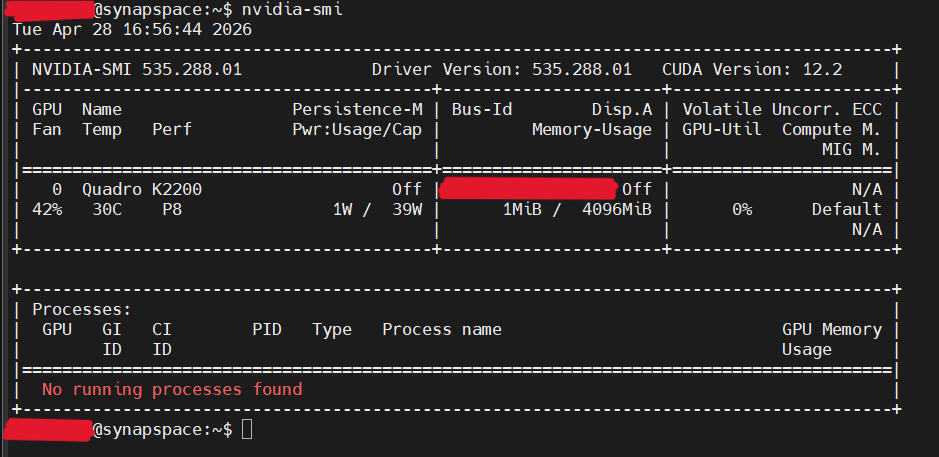
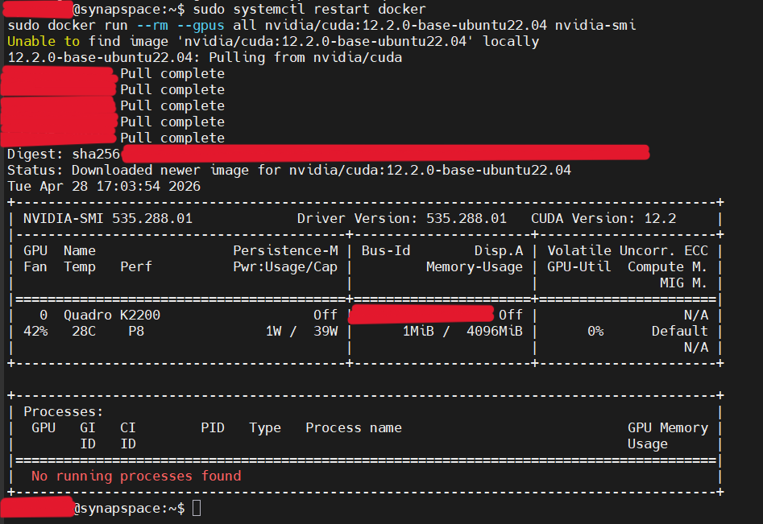
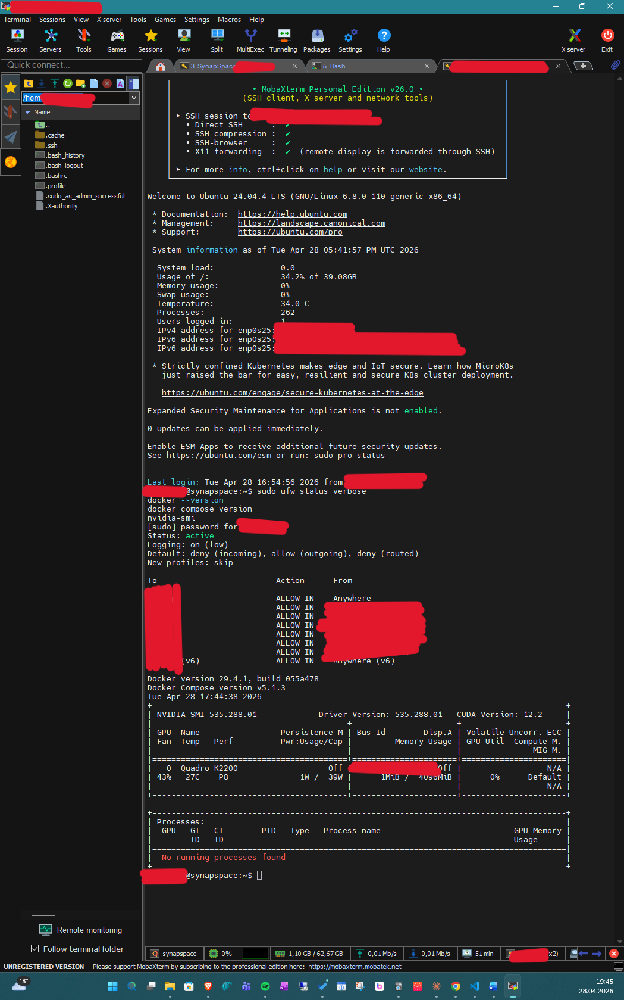

# PHASE_1 – Basis-Infrastruktur
**Status: ✅ COMPLETE**
**Zeitraum:** 2026-04-28 | **Aufwand:** ~5h

---

## Schritte
1. ✅ Ubuntu Server 24.04 LTS Installation
2. ✅ LVM-Konfiguration (40GB root, 404GB docker)
3. ✅ NVIDIA-Driver + Container Toolkit
4. ✅ Docker + Docker-Compose
5. ✅ UFW-Firewall
6. ✅ SSH-Key-Setup

---

## Fortschritt

### 1. Ubuntu Installation
- ✅ USB geflasht (Rufus, GPT, UEFI, FAT32)
- ✅ Server von USB gebootet (F12 Boot-Menü)
- ✅ Netzwerk: enp0s25 via DHCP → `<SERVER_IP>`/24 (Installer)
  - ⚠️ Ethernet-Kabel fehlte initial → bond-Dialog abgebrochen → Kabel eingesteckt → DHCP retry
- ✅ Proxy: leer, Mirror: de.archive.ubuntu.com
- ✅ Installer-Update, Ubuntu Pro, Featured Snaps: übersprungen/abgewählt

### 2. LVM-Konfiguration
- ✅ P1: 1.049G fat32 /boot/efi | P2: 2G ext4 /boot | P3: 444G → PV vg-synapspace
- ✅ lv-root: 40G ext4 / | lv-docker: 404G ext4 /var/lib/docker
- ✅ Verifiziert via lsblk -f / df -h / pvs+vgs+lvs
  - ℹ️ df -h zeigt 397G für lv-docker: ext4 Reserved Blocks (~5%) – kein Fehler

### Installation & Erster Boot
- ✅ Hostname: synapspace
- ✅ IP nach Reboot: `<SERVER_IP>`/24 (DHCP)
- ✅ SSH manuell aktiviert: `sudo systemctl enable ssh --now`
  - ⚠️ Ubuntu 24.04: SSH trotz Installer-Auswahl nach Reboot inactive
- ✅ Erster SSH-Login via MobaXterm erfolgreich
- ✅ Monitor/Tastatur abgebaut – Headless-Betrieb ab jetzt

### 3. NVIDIA Driver + Container Toolkit
- ✅ `sudo ubuntu-drivers install` + reboot
- ✅ nvidia-smi: Quadro K2200 | 4096MiB | Driver `<NVIDIA_DRIVER_VERSION>` | CUDA 12.2
- ✅ NVIDIA Container Toolkit installiert (nvidia.github.io Repository)
- ✅ `nvidia-ctk runtime configure --runtime=docker` → /etc/docker/daemon.json geschrieben

### 4. Docker
- ✅ Docker CE aus offiziellem Docker-Repository installiert (inkl. docker-compose-plugin)
- ✅ GPU-Passthrough-Test erfolgreich: `docker run --gpus all nvidia/cuda:12.2.0-base-ubuntu22.04 nvidia-smi`

### 5. UFW-Firewall
- ✅ Port 22/tcp global erlaubt (SSH)
- ✅ Ports 5678, 3000, 9000, 11434, 6333, 8080 nur für `<HOME_SUBNET>` erlaubt
- ✅ Default-Policy: deny incoming, allow outgoing
- ✅ UFW aktiv und verifiziert via `ufw status verbose`

### 6. SSH-Key-Setup
- ✅ Ed25519-Key generiert auf Dev-Node (MobaXterm lokale Shell)
- ✅ Public Key via ssh-copy-id auf Server übertragen (1 key added)
- ✅ Key-Login verifiziert – neue Session erfolgreich ohne Passwort
- ✅ PasswordAuthentication deaktiviert in /etc/ssh/sshd_config
- ✅ sshd neu gestartet

---

## Abschluss

---

## Konfigurationen

### Betriebssystem
- **OS:** Ubuntu Server 24.04 LTS (Bare-Metal)
- **Hostname:** synapspace

### LVM (Hauptserver)
- **VG:** vg-synapspace (444.078G, PV = Partition 3 der Intel SSD)
- **lv-root:** 40G, ext4, /
- **lv-docker:** 404G, ext4, /var/lib/docker
  - ⚠️ **Spätere Korrektur:** lv-docker in Phase 4.5 auf **374G** verkleinert (~30G VG-Reserve für LVM-Snapshots) → [PHASE_4_5_san.md](./PHASE_4_5_san.md)

### Partitionen (Intel SSD)
- P1: 1.049G fat32 → /boot/efi (ESP)
- P2: 2G ext4 → /boot
- P3: 444.079G unformatiert → PV vg-synapspace

### NVIDIA
- **Driver:** `<NVIDIA_DRIVER_VERSION>` (via ubuntu-drivers install)
- **CUDA:** 12.2
- **Container Toolkit:** nvidia-container-toolkit (nvidia.github.io Repository)
- **Docker Runtime Config:** /etc/docker/daemon.json (via nvidia-ctk runtime configure)

### Docker
- **Installation:** Docker CE aus offiziellem Docker-Repository (download.docker.com)
- **Pakete:** docker-ce, docker-ce-cli, containerd.io, docker-compose-plugin

### UFW
- **Status:** aktiv
- **Default:** deny incoming, allow outgoing
- **Port 22/tcp:** ALLOW IN Anywhere
  - ⚠️ **Spätere Korrektur:** Phase-1-Regelstand (Port 22 „Anywhere") in Phase 4.5 auf `<HOME_SUBNET>` gehärtet → [PHASE_4_5_san.md](./PHASE_4_5_san.md)
- **Ports 5678, 3000, 9000, 11434, 6333, 8080:** ALLOW IN `<HOME_SUBNET>`

### SSH
- **Key-Typ:** Ed25519
- **Kommentar:** synapspace-admin
- **Public Key Speicherort:** /home/`<USER>`/.ssh/authorized_keys
- **PasswordAuthentication:** no (/etc/ssh/sshd_config)

---

## Lessons Learned

### Installation
- ⚠️ Ethernet-Kabel VOR dem Boot einstecken – DHCP sonst nicht möglich
- ⚠️ „Create bond" nur bei mehreren NICs – bei Einzelkarte immer abbrechen
- ⚠️ Ubuntu 24.04: SSH trotz Installer-Auswahl nicht automatisch aktiv → `sudo systemctl enable ssh --now`
- ⚠️ LUKS auf Headless-Servern vermeiden – Passphrase bei Reboot nicht möglich
- ℹ️ Predictable Network Naming: enp0s25 = Ethernet, PCI-Bus x, Slot x
- ℹ️ EFI-Partition im Subiquity Custom Layout: Disk → „Use as Boot Device" → ESP automatisch korrekt (fat32)
- ℹ️ vfat nicht im Format-Dropdown wählbar – wird automatisch gesetzt bei Mount /boot/efi
- ℹ️ Installer-Update überspringen („Continue without updating") – kein MVP-Mehrwert
- ℹ️ sudo-Passwort-Prompt kann mitten in verketteten Befehlen erscheinen → Ausgabe erst vollständig nach Eingabe
- ℹ️ Headless-Betrieb ab Phase 1 vollständig – Monitor/Tastatur am Server nicht mehr erforderlich

### Docker & NVIDIA
- ⚠️ NVIDIA Container Toolkit kann vor Docker installiert werden – nvidia-ctk schreibt daemon.json erfolgreich, Docker-Dienst aber erst nach Docker-Installation startbar
- ℹ️ Docker immer aus offiziellem Docker-Repository installieren (nicht Ubuntu-Paketquellen) → aktuellere Version + docker-compose-plugin enthalten

### SSH-Hardening
- ℹ️ Reihenfolge: Key-Login verifizieren → erst dann PasswordAuthentication deaktivieren – verhindert Aussperren
- ℹ️ Ed25519 bevorzugen gegenüber RSA – kompakter, moderner, sicherer
