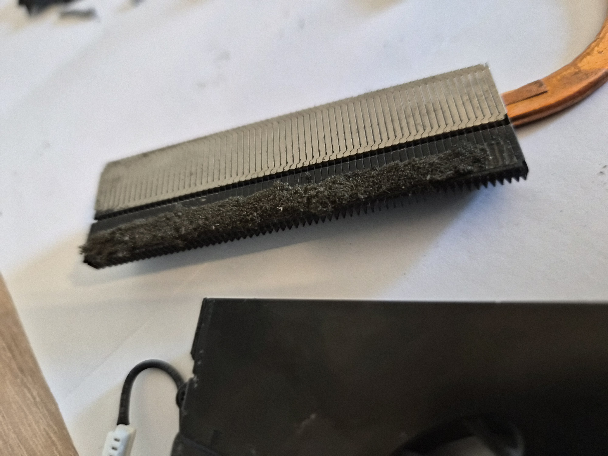
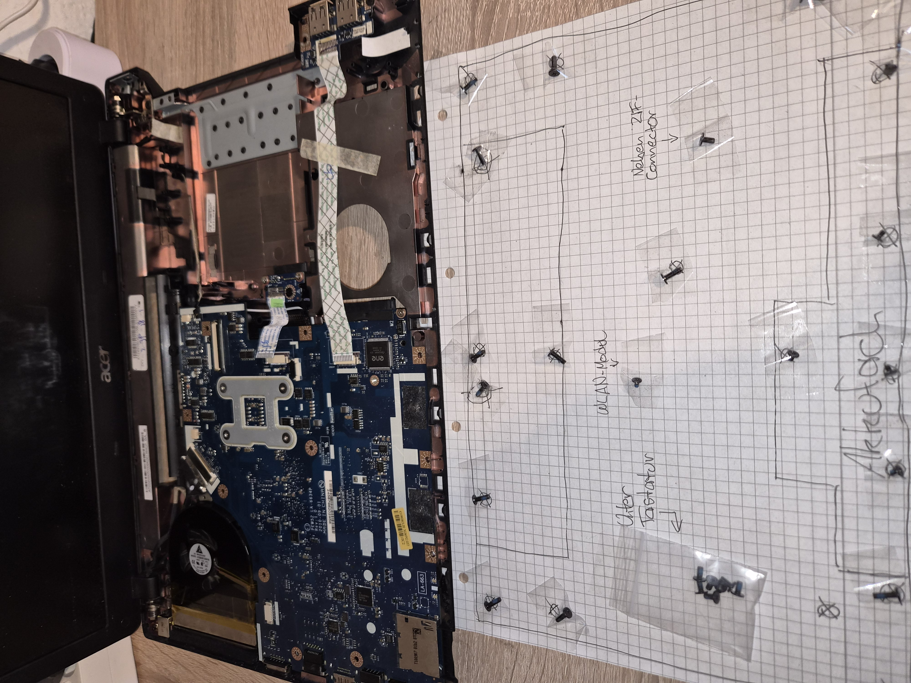
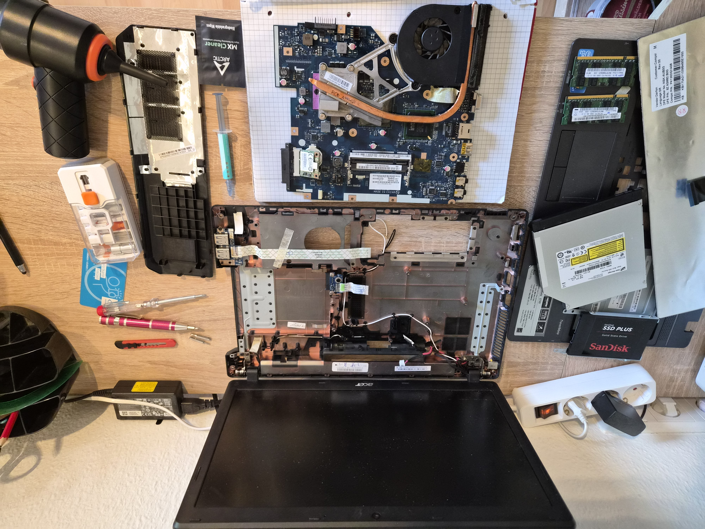
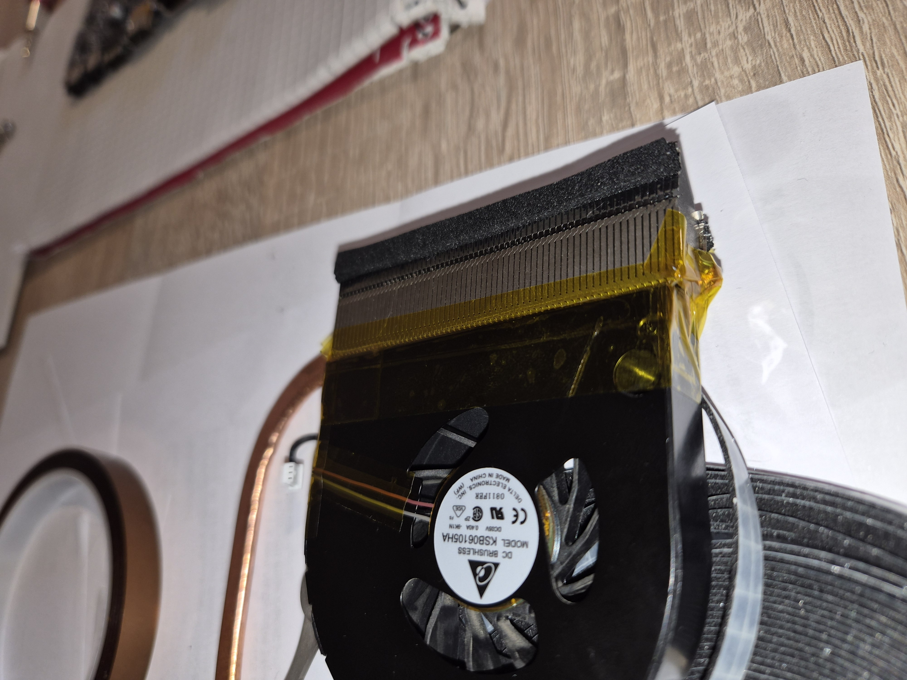
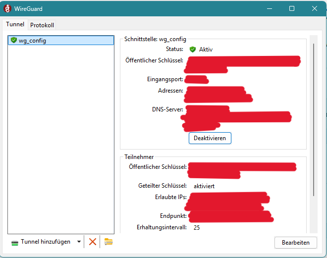
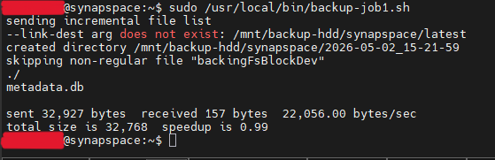
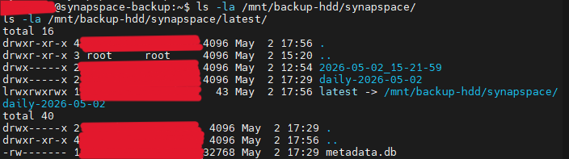
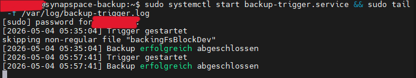
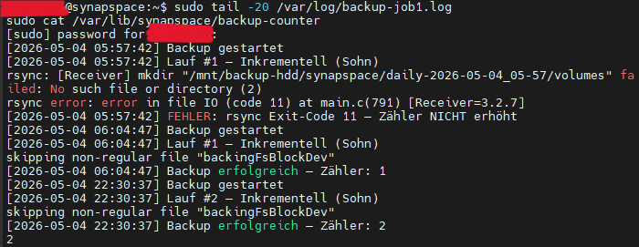

# PHASE_2 – Netzwerk, Backup & Backup-Node-Vorbereitung
**Status: ✅ COMPLETE**
**Zeitraum:** 2026-04-29 bis 2026-05-04
**Aufwand:** ~5h Laptop-Wartung + ~7h Netzwerk/Backup/Sicherheitskonzept

---

## Schritte
1. ✅ Backup-Node Hardware-Wartung (Acer TravelMate 5735)
2. ✅ Ubuntu Server 24.04 LTS Installation auf Backup-Node
3. ✅ Statische IP via Netplan konfigurieren (Haupt- und Backup-Server)
4. ✅ WireGuard VPN (FritzBox 7530 als Gateway)
5. ✅ NFS-Server + Samba auf Backup-Node einrichten
6. ✅ rsync-Cronjobs + GVS-Backup-Strategie
7. ✅ Backup-Node Headless-Config (Lid-Switch + Shutdown-Cronjob)
8. ✅ etckeeper (Konfigurationsversionierung via git)
9. ✅ sysconfig-export Skript (wöchentlicher System-State-Snapshot)
10. ✅ Externe HDD eingebunden (ext4, fstab, persistent)
11. ✅ Fujitsu BIOS: RTC Wake 22:00 täglich + Power Failure Recovery „Power On"
12. ✅ Persistent Backup Trigger + GVS-Zähler-Logik

---

## Schritt 1: Backup-Node Hardware-Wartung
**Zeitraum:** 2026-04-29 bis 2026-04-30 | **Aufwand:** ~5h

### Durchgeführte Arbeiten
- ✅ Laptop vollständig zerlegt
- ✅ Lüfter + Kühlkörper-Lamellen: Staubeintrag entfernt (Druckluft)
- ✅ Alte Schaumstoffdichtung am Lüfterrahmen: porös/zerfallen → ersetzt
- ✅ Neue Lüfterdichtung: EPDM-Zellkautschuk-Band (UL94-HBF) zugeschnitten und geklebt
- ✅ Verbindung Lüfter/Heatsink: Original-Gewebeband → Kapton-Band ersetzt
- ✅ Wärmeleitpaste erneuert: Arctic MX-4, Reinigung mit Arctic-Tüchern
- ✅ Zusammenbau + Funktionstest erfolgreich

### Materialien
| Material | Kosten |
|----------|--------|
| Arctic Wärmeleitpaste-Set (inkl. Reinigungstücher) | 10,99€ |
| EPDM-Zellkautschuk-Band (UL94-HBF) | 6,50€ |
| Kapton-Band | 6,49€ |
| Laptop Vertical Stand | 18,99€ |

### Foto-Dokumentation









### Lessons Learned
- ℹ️ Gefangene Schrauben bei Acer-Laptops dieser Ära: drehen frei wenn gelöst, kommen nicht raus – normal
- ℹ️ Gehäuse-Clips: an Akkuöffnung beginnen, flach hebeln, nie mit Metall
- ℹ️ Arctic-Reinigungstücher ersetzen Isopropanol vollständig
- ℹ️ Kapton-Band ist hitzebeständiger als Original-Gewebeband
- ℹ️ EPDM-Zellkautschuk als Schaumstoffdichtungs-Ersatz: komprimierbar, hitzebeständig, passend

---

## Schritt 2: Ubuntu Server 24.04 LTS Installation (Backup-Node)
**Status: ✅ COMPLETE**

### Konfigurationen

#### Betriebssystem
- **OS:** Ubuntu Server 24.04 LTS
- **Hostname:** synapspace-backup

#### Storage-Layout (kein LVM)
| Partition | Größe | Format | Mount |
|-----------|-------|--------|-------|
| P1 (BIOS grub spacer) | 1 MB | - | - |
| P2 | 2 GB | ext4 | /boot |
| P3 | 30 GB | ext4 | / |
| P4 | ~79 GB | ext4 | /mnt/backup-ssd |

#### SSH
- **Key-Typ:** Ed25519 (selber Key wie Hauptserver)
- **PasswordAuthentication:** no (/etc/ssh/sshd_config)

### Lessons Learned
- ⚠️ Akku nicht fit – Ladegerät immer einstecken
- ⚠️ GRUB-Shell statt Installer: `normal` eintippen behebt minimalen GRUB-Boot
- ⚠️ Rufus ISO-Modus auf älterer Hardware problematisch → DD-Modus zuverlässiger
- ℹ️ Windows Fastboot verhindert BIOS-Zugang → Weg über Windows-Wiederherstellung
- ℹ️ Backup-Node bootet im Legacy-BIOS-Modus → BIOS grub spacer statt EFI-Partition

---

## Schritt 3: Statische IPs via Netplan
**Status: ✅ COMPLETE**

### Konfigurationen

| Server | Hostname | NIC | IP (statisch) | Netplan-Datei |
|--------|----------|-----|---------------|---------------|
| Hauptserver | synapspace | enp0s25 | `<SERVER_IP>`/24 | 50-cloud-init.yaml |
| Backup-Node | synapspace-backup | enp5s0 | `<BACKUP_IP>`/24 | 00-installer-config.yaml |

- **Gateway:** `<GATEWAY_IP>` (FritzBox 7530)
- **DNS:** `<GATEWAY_IP>`
- **Berechtigungen:** `chmod 600` auf beide Netplan-Dateien

### Lessons Learned
- ⚠️ Netplan-Dateiname variiert – immer erst `ls /etc/netplan/` prüfen
- ⚠️ `netplan apply` trennt sofort die SSH-Session – neue Session mit neuer IP bereithalten
- ℹ️ `chmod 600` auf Netplan-Dateien Pflicht
- ℹ️ Statische IP außerhalb des DHCP-Bereichs wählen
- ℹ️ Veralteter DHCP-Lease verschwindet nach Reboot – kein Konfigurationsfehler

---

## Schritt 4: WireGuard VPN
**Status: ✅ COMPLETE**

### Konfigurationen

#### FritzBox 7530
- **MyFRITZ:** Aktiviert
- **2FA:** TOTP via Ente Auth aktiviert
- **Passwort:** Auf komplexes Kennwort umgestellt
- **Peers:** 1 aktiver Peer (Samsung Galaxy Z Flip 7)

#### WireGuard-Peers
| Peer | Gerät | Tunnel-Modus | Zweck |
|------|-------|-------------|-------|
| zflip7 | Samsung Galaxy Z Flip 7 | Split-Tunnel (default) / Full-Tunnel (öffentl. WLAN) | Mobile Administration + Cloud-LLMs |

- **Split-Tunnel:** AllowedIPs = `<HOME_SUBNET>`
- **Full-Tunnel:** AllowedIPs = `0.0.0.0/0` (öffentliche WLANs)
- **OnePlus A6013:** Kein WireGuard – stationäres Monitoring-Display, direkter Heimnetz-Zugriff
- **Schlüsselhygiene:** Export-Files nach QR-Code-Import gelöscht



### Lessons Learned
- ℹ️ Split-Tunnel als Default, Full-Tunnel für untrusted Networks
- ℹ️ MyFRITZ-Konto Pflicht für externen Zugriff via LTE/5G
- ℹ️ FritzBox übernimmt komplette Key-Generierung
- ℹ️ Export-Files nach Import sofort löschen

---

## Schritt 5: NFS-Server + Samba (Backup-Node)
**Status: ✅ COMPLETE**

### Backup-Scope
 
| Client | Protokoll | Zielverzeichnis |
|--------|-----------|-----------------|
| Hauptserver (Docker-Volumes) | rsync over SSH | /mnt/backup-hdd/synapspace/ |
| Linux Client (privat) | NFS | /mnt/backup-ssd/linux-client/ |
| Windows (privat) | SMB (Samba) | /mnt/backup-ssd/privat/ |
 
#### Verzeichnisstruktur
```
/mnt/backup-ssd/          # interne SSD ~79GB
├── linux-client/         # Linux Client privat (NFS)
└── privat/               # Windows private Dateien (Samba)
 
/mnt/backup-hdd/          # externe 500GB USB-HDD (ext4)
├── synapspace/           # Docker-Volumes Hauptserver (GVS)
│   └── sysconfig/        # Wöchentlicher System-State-Export
└── latest -> ...         # Symlink auf letztes Backup
```
 
#### NFS-Konfiguration (`/etc/exports`)
- **Export:** `/mnt/backup-ssd/linux-client <HOME_SUBNET>(rw,sync,no_subtree_check)`
- **Berechtigungen:** `nobody:nogroup`, `chmod 777` (temporär)
- **Dienst:** `nfs-kernel-server`
#### Samba-Konfiguration (`/etc/samba/smb.conf`)
- **Share:** `[privat]` → `/mnt/backup-ssd/privat/`
- **User:** `backupuser` (kein Home `-M`, kein Shell-Zugang `-s /usr/sbin/nologin`)
- **Berechtigungen:** `chmod 700`, Besitzer `backupuser:backupuser`
- **Zugriffsbeschränkung:** `valid users = backupuser`, `hosts allow = <HOME_SUBNET> 127.0.0.1`
### Lessons Learned
- ⚠️ Samba versehentlich auf Hauptserver installiert → `apt remove --purge samba` (Minimalprinzip)
- ⚠️ Immer Hostname prüfen bevor Pakete installiert werden
- ⚠️ Nie von Server zu Server SSH-en wenn direkte MobaXterm-Tabs verfügbar sind
- ℹ️ `testparm` vor jedem `systemctl restart smbd`
- ℹ️ `echo $SSH_CLIENT` zeigt tatsächliche Client-IP – nützlich zur VPN-Verifikation

---

## Schritt 6: rsync-Cronjobs + GVS-Backup-Strategie
**Status: ✅ COMPLETE**

### Backup-Strategie (Großvater-Vater-Sohn)

| Ebene | Typ | Aufbewahrung |
|-------|-----|--------------|
| Sohn | Inkrementell | 7 Tage |
| Vater | Differentiell | 3 Wochen |
| Großvater | Vollbackup | 2 Monate (max. 2 Stück) |

- **Basis inkrementell:** letztes vorhandenes Backup (`--link-dest`)
- **Basis differentiell:** letztes Vollbackup (`--link-dest`)
- **Ausschlüsse:** `ollama/models/` (neu pullbar), `*.tmp`
- **Skript:** `/usr/local/bin/backup-job1.sh` (Hauptserver, läuft als root)
- **SSH-Key:** Ed25519, passwortlos (root → Backup-Node)





### Lessons Learned
- ℹ️ `--link-dest` macht jeden Snapshot vollständig wiederherstellbar ohne Vollbackup-Speicherbedarf
- ℹ️ Passwortloser SSH-Key für Cronjobs Pflicht
- ℹ️ `skipping non-regular file "backingFsBlockDev"` ist kein Fehler
- ℹ️ Ollama-Modelle vom Backup ausschließen – spart massiv Speicher

---

## Schritt 7: Backup-Node Headless-Config
**Status: ✅ COMPLETE**

### Konfigurationen

#### Lid-Switch (synapspace-backup)
- **Datei:** `/etc/systemd/logind.conf`
- **Einstellung:** `HandleLidSwitch=ignore`
- **Verifikation:** SSH-Verbindung bleibt bei geschlossenem Deckel aktiv ✅

#### BIOS-Analyse (Acer TravelMate 5735, InsydeH20 Rev. 3.5)
- RTC-Wake: **nicht vorhanden**
- AC Power Recovery: **nicht vorhanden**
- **Konsequenz:** Halbautomatischer Betrieb – manuelles Einschalten, automatischer Shutdown

#### Cronjobs (synapspace-backup, root-crontab)
```
15 23 * * * /sbin/shutdown -h now
```

**Betriebsablauf:**
- Manuell einschalten (~22:00)
- Backup läuft automatisch 22:30
- Shutdown automatisch 23:15

### Lessons Learned
- ℹ️ InsydeH20 BIOS (Laptop-Klasse) bietet selten RTC-Wake
- ℹ️ `HandleLidSwitch=ignore` greift erst nach vollständigem Reboot zuverlässig
- ℹ️ USB-Geräte nie umstecken während sie gemountet sind – erst `umount`, dann umstecken

---

## Schritt 8: etckeeper
**Status: ✅ COMPLETE**

### Konfigurationen
- **Installiert auf:** synapspace + synapspace-backup
- **Backend:** git
- **Pfad:** `/etc/.git/`
- **Automatik:** Hängt sich in apt ein – jede Paketinstallation = automatischer Commit
- **Manueller Commit:** `sudo etckeeper commit "Beschreibung"` nach manuellen Änderungen

---

## Schritt 9: sysconfig-export Skript
**Status: ✅ COMPLETE**

### Konfigurationen
- **Skript:** `/usr/local/bin/sysconfig-export.sh` (Hauptserver, läuft als root)
- **Cronjob:** `10 22 * * 7` (Sonntags 22:10, vor dem Backup)
- **Ziel:** `<USER>@<BACKUP_IP>:/mnt/backup-hdd/synapspace/sysconfig/DATUM/`
- **Inhalt:** LVM-Layout, UFW-Regeln, root-Crontab, Paketliste, Docker-Container + Volumes

### Cronjob-Übersicht Hauptserver (root-crontab, final)
```
10 22 * * 7   /usr/local/bin/sysconfig-export.sh   # Sonntags 22:10
30 23 * * *   /sbin/shutdown -h now                 # täglich 23:30
```

### Lessons Learned
- ℹ️ Zielverzeichnis auf Backup-Server muss manuell angelegt werden – rsync erstellt es nicht
- ℹ️ sysconfig-Export läuft vor dem Backup – aktueller State ist Teil des Snapshots

---

## Schritt 10: Externe HDD (500GB USB)
**Status: ✅ COMPLETE**

### Konfigurationen
- **Gerät:** /dev/sda1 (ext4, GPT)
- **UUID:** `<HDD_UUID>`
- **Mount-Punkt:** /mnt/backup-hdd
- **fstab:** `UUID=<HDD_UUID> /mnt/backup-hdd ext4 defaults,nofail 0 2`
- **Verfügbar:** 434 GB

### Lessons Learned
- ℹ️ NTFS unterstützt keine Linux-Berechtigungen und keine Hardlinks → ext4 zwingend
- ℹ️ `nofail` in fstab verhindert Boot-Fehler wenn HDD nicht angeschlossen
- ℹ️ Vor USB-Umstecken immer erst `sudo umount /mnt/backup-hdd`

---

## Schritt 11: Fujitsu BIOS-Konfiguration
**Status: ✅ COMPLETE**

### Konfigurationen
- **RTC Wake Timer:** Enabled, täglich 22:00 → Fujitsu startet automatisch vor Backup-Fenster
- **Power Failure Recovery:** „Power On" → automatischer Start nach Stromausfall
- **Wake on LAN:** Enabled (im BIOS + Netplan `wakeonlan: true`)
- **WoL praktisch:** Magic Packet funktioniert nicht zuverlässig (S5-Zustand) → RTC Wake als primäre Lösung
- **MAC-Adresse enp0s25:** `<MAC_ADRESSE>`

### Lessons Learned
- ℹ️ RTC Wake Timer ist zuverlässiger als WoL für geplante nächtliche Starts
- ℹ️ WoL erfordert dass NIC im S5-Zustand aktiv bleibt – nicht alle BIOS unterstützen das vollständig
- ℹ️ Workstation-BIOS (Fujitsu Celsius) bietet deutlich mehr Power-Management-Optionen als Laptop-BIOS

---

## Schritt 12: Persistent Backup Trigger + GVS-Zähler-Logik
**Status: ✅ COMPLETE**
**Zeitraum:** 2026-05-04 | **Aufwand:** ~1h

### Problem
- Backup-Node manuell einzuschalten → verpasste Backup-Nächte möglich
- Datum-basierte GVS-Logik: verpasster Sonntag = kein Weekly, verpasster 1. = kein Monthly
- Race Condition: Hauptserver-Cron + Remote-Trigger liefen parallel auf gleichem Skript

### Lösung

#### A: SSH-Trigger (Backup-Node → Hauptserver)
- **Key:** Ed25519, passwortlos (`/root/.ssh/id_ed25519_trigger`)
- **Autorisiert:** `/home/<USER>/.ssh/authorized_keys` auf Hauptserver (2 Keys: synapspace-admin + backup-trigger)
- **Sudo-Regel:** `/etc/sudoers.d/backup-trigger` → `<USER> ALL=(ALL) NOPASSWD: /usr/local/bin/backup-job1.sh`
- **Skript:** `/usr/local/bin/trigger-backup.sh` (Backup-Node, root)

#### B: systemd Timer mit Persistent=true (Backup-Node)
- **Service:** `/etc/systemd/system/backup-trigger.service` (Type=oneshot, After=network-online.target)
- **Timer:** `/etc/systemd/system/backup-trigger.timer` (OnCalendar=*-*-* 22:30:00, **Persistent=true**, RandomizedDelaySec=60)
- **Effekt:** Verpasste Backup-Nächte werden beim nächsten Boot sofort nachgeholt

#### C: GVS-Zähler-Logik (ersetzt Datum-basierte Logik)
- **Counter-Datei:** `/var/lib/synapspace/backup-counter` (Hauptserver)
- **Logik:**
  - `Zähler % 28 == 0` → Vollbackup (Großvater)
  - `Zähler % 7 == 0` → Differentiell (Vater)
  - Sonst → Inkrementell (Sohn)
- **Zähler-Update:** Nur bei erfolgreichem rsync (Exit 0 oder 24)
- **Vorteil:** GVS-Rhythmus kalenderunabhängig, robust gegen ausgefallene Nächte

#### D: Hauptserver-Cron bereinigt
- `backup-job1.sh` aus root-crontab entfernt → kein Doppel-Trigger mehr

### Verzeichnisstruktur Backup-HDD (final)
```
/mnt/backup-hdd/synapspace/
├── daily-YYYY-MM-DD_HH-MM/volumes/    # Inkrementell (7 Tage Retention)
├── weekly-YYYY-MM-DD_HH-MM/volumes/   # Differentiell (3 Wochen Retention)
├── monthly-YYYY-MM-DD_HH-MM/volumes/  # Vollbackup (2 Monate, max. 2 Stück)
├── sysconfig/                          # wöchentlicher System-State-Export
└── latest -> ...                       # Symlink auf letztes Backup
```





### Lessons Learned
- ⚠️ Race Condition: Zwei parallele Trigger auf dasselbe Skript → immer genau einen Trigger definieren
- ⚠️ `sudo tee` überschreibt nicht wenn Datei schon befüllt – erst mit `tee` (ohne `-a`) neu schreiben, dann mit `tee -a` anhängen
- ℹ️ systemd `Persistent=true` speichert letzten Lauf in `/var/lib/systemd/timers/` – robust gegen Ausfälle
- ℹ️ rsync erstellt keine verschachtelten Zielverzeichnisse – `mkdir -p` via SSH vor rsync zwingend
- ℹ️ Exit-Code 24 bei rsync = "vanishing files" (Dateien während Transfer gelöscht) – kein echter Fehler, als Erfolg werten
- ℹ️ Zähler-basierte GVS ist kalenderunabhängig – korrekte Backup-Typen auch bei unregelmäßigem Betrieb
