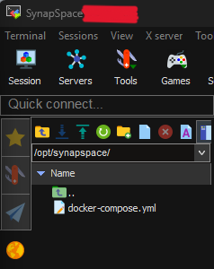
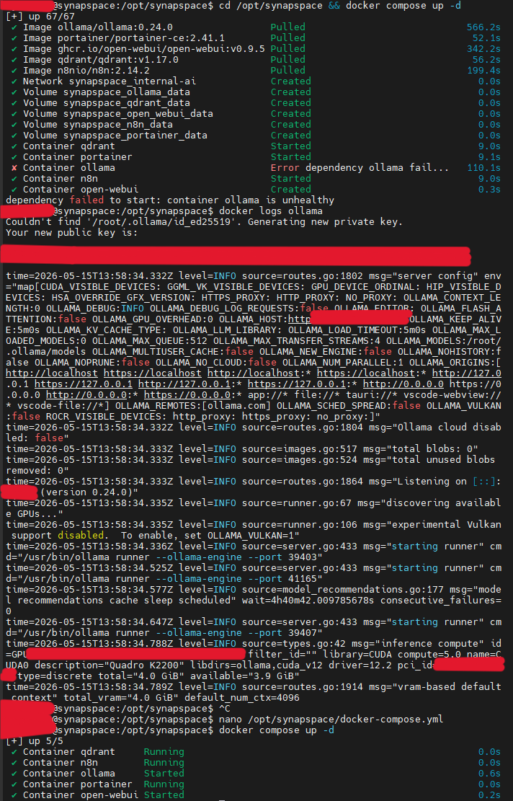
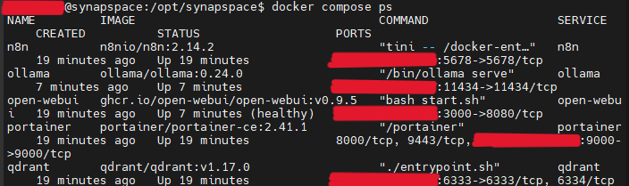
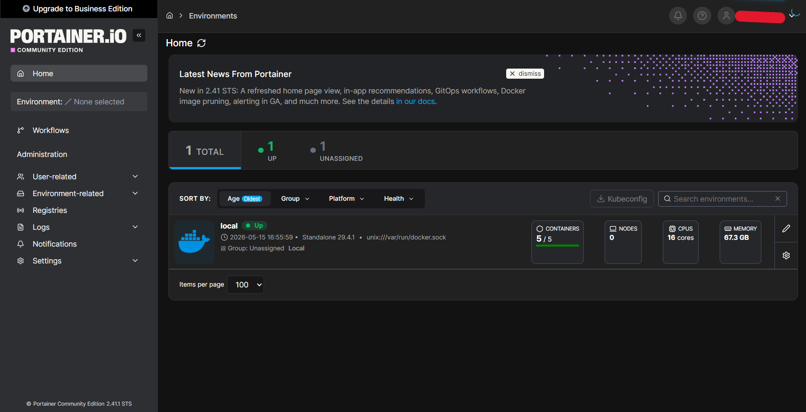
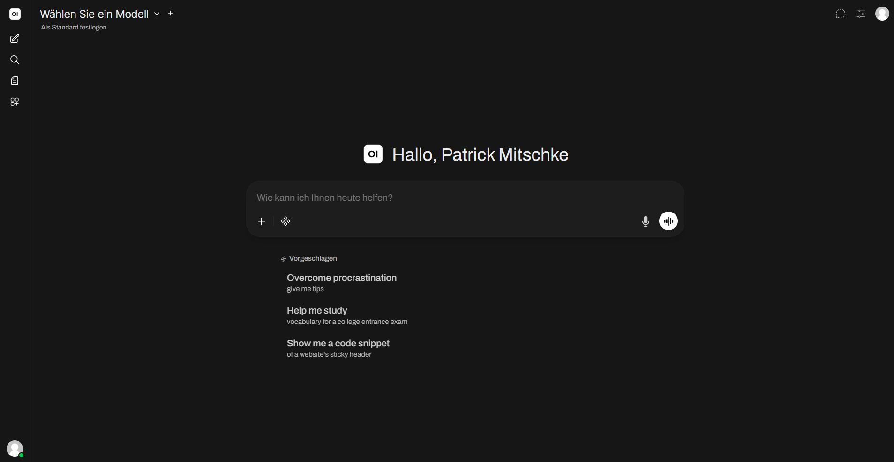
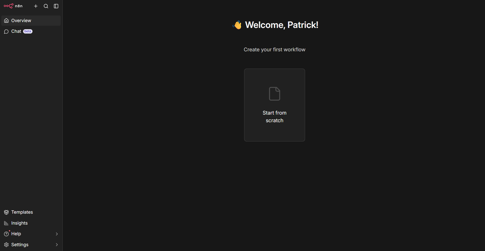
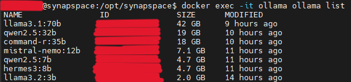
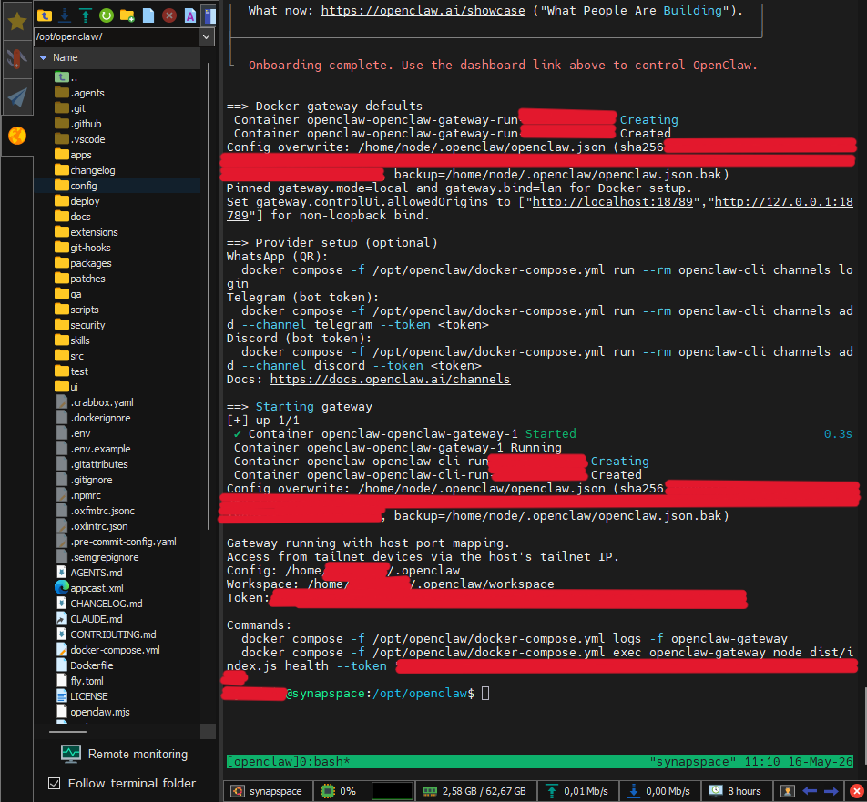

# PHASE_3 – Stack, Modelle & DEX
**Status: ✅ COMPLETE**
**Zeitraum:** 2026-05-15 bis 2026-05-16 | **Aufwand:** ~18h

---

## Schritte
1. ✅ docker-compose.yml erstellen + Stack starten (n8n, Ollama, Qdrant, Open WebUI, Portainer)
2. ✅ LLM-Modelle via Ollama pullen (100GB Limit)
3. ✅ OpenClaw/DEX Installation + Konfiguration (SOUL.md, AGENTS.md – KEINE Custom Skills im MVP)

---

## Schritt 1: docker-compose.yml + Stack
**Status: ✅ COMPLETE**

### Konfigurationen

#### docker-compose.yml
- **Pfad:** /opt/synapspace/docker-compose.yml
- **Netzwerk:** synapspace_internal-ai (Bridge)
- **Port-Binding:** Alle Ports an `<SERVER_IP>` gebunden (UFW-Bypass-Schutz)
- **Restart-Policy:** unless-stopped

#### Services & Image-Versionen
| Service | Image | Port |
|---------|-------|------|
| Portainer CE | portainer/portainer-ce:2.41.1 | 9000 |
| Ollama | ollama/ollama:0.24.0 | 11434 |
| Qdrant | qdrant/qdrant:v1.17.0 | 6333 |
| Open WebUI | ghcr.io/open-webui/open-webui:v0.9.5 | 3000 (→8080) |
| n8n | n8nio/n8n:2.14.2 | 5678 |

Die fertige `docker-compose.yml` wurde via SFTP auf den Server übertragen und der Stack gestartet.

Beim ersten `docker compose up -d` schlug Ollama zunächst fehl – die Quadro K2200 (Compute 5.0) ist inkompatibel mit der aktuellen Ollama-Version in Docker. Nach Anpassung der Konfiguration liefen alle 5 Container stabil.

#### Initiale Setups abgeschlossen
- Portainer: Admin-Account angelegt, lokale Docker-Umgebung verbunden
- Open WebUI: Admin-Account angelegt
- n8n: Owner-Account angelegt, Free License Key aktiviert

Mit Portainer steht ein grafisches Management-Interface für den gesamten Docker-Stack zur Verfügung. Open WebUI und n8n waren nach dem ersten Login direkt einsatzbereit.

#### Sicherheit
- UFW: Port 8080 entfernt, Port 18789 für OpenClaw/DEX hinzugefügt
- UFW/Docker-Bypass-Fix: DOCKER-USER Chain in /etc/ufw/after.rules konfiguriert

---

## Schritt 2: LLM-Modelle pullen
**Status: ✅ COMPLETE**

Alle 7 Modelle wurden über Ollama gezogen – kleine Modelle zuerst zum Testen, die großen (32B, 70B) über Nacht. Der Download läuft vollständig lokal; kein Modell verlässt das Heimnetz.

### Installierte Modelle

| Modell | Größe | Rolle |
|--------|-------|-------|
| llama3.2:3b | 2.0 GB | Triage & Routing (DEX) |
| hermes3:8b | 4.7 GB | Tool-Calling / DEX-Motor |
| qwen2.5:7b | 4.7 GB | Linux-Administration |
| mistral-nemo:12b | 7.1 GB | Textvorfilterung (128k Kontext) |
| command-r:35b | 18 GB | RAG-Spezialist |
| qwen2.5:32b | 19 GB | Komplexe Logik / Mathematik |
| llama3.1:70b | 42 GB | Qualitätskontrolle über Nacht |

**Gesamt:** ~97.5 GB (Limit: 100 GB ✅)

### GPU-Status
- **Aktuell:** CPU-only (Quadro K2200 Compute 5.0 inkompatibel mit Ollama in Docker)
- **Ausstehend:** MSI Aero GTX 1070 8GB OC – Einbau folgt in Phase 4

---

## Schritt 3: OpenClaw/DEX Installation
**Status: ✅ COMPLETE**

### DEX – Dynamic Educational eXpander
Agentisches AI-Gateway auf Basis von OpenClaw, konfiguriert als persönlicher Bildungs- und Karrierecoach. DEX ist der einzige Stack-Bestandteil, der proaktiv agiert – alle anderen Komponenten warten auf Trigger. Über Telegram ist DEX jederzeit erreichbar, auch mobil.

### Konfigurationen

#### Installation
- **Repo:** /opt/openclaw
- **Image:** ghcr.io/openclaw/openclaw:2026.5.12 (enthält CVE-Patches)
- **Port:** 18789
- **Wizard:** `./scripts/docker/setup.sh` in tmux
- **Sandbox-Image:** `openclaw-sandbox:bookworm-slim` (gebaut via `./scripts/sandbox-setup.sh`)

#### Sicherheitskonfiguration
- **Sandbox:** mode: non-main, scope: agent ✅
- **Heartbeat:** deaktiviert (every: 0m) ✅
- **Dangerous Tools gesperrt:** gateway, cron, sessions_spawn ✅
- **Telegram-Allowlist:** aktiviert (nur autorisierter Nutzer) ✅
- **Docker CLI:** gemountet via OPENCLAW_EXTRA_MOUNTS ✅
- **Docker Socket:** /var/run/docker.sock gemountet ✅
- **DOCKER_GID:** `<DOCKER_GID>` ✅

#### Workspace-Dateien
- **SOUL.md:** Persönlichkeit DEX (sachlich, direkt, kein Lob, kein Smalltalk)
- **AGENTS.md:** Verhaltensregeln (Shell nur in Sandbox, Dateioperationen nur mit Freigabe)

#### Telegram-Bot
- **Bot-Name:** DEX – Dynamic Educational eXpander
- **Kanal:** Telegram Bot API

Der Setup-Wizard wurde in einer tmux-Session ausgeführt, um SSH-Disconnect-Risiken zu vermeiden. Nach erfolgreichem Abschluss startete das Gateway sofort und DEX war über Telegram erreichbar.

---

## Lessons Learned

### Docker Compose & Stack
- ⚠️ Portainer: Initial-Setup innerhalb 5 Minuten → sonst Timeout → `docker restart portainer`
- ⚠️ User nicht automatisch in docker-Gruppe → `sudo usermod -aG docker <USER> && newgrp docker`
- ⚠️ containerd speichert Layer-Daten auf Root-Partition → Symlink auf Docker-Volume Pflicht
- ⚠️ Shutdown ohne `docker compose down` → RWLayer-Korruption → Shutdown-Cronjob angepasst
- ⚠️ UFW-Port-Binding: Docker umgeht UFW → Ports an spezifische IP binden + DOCKER-USER Chain
- ℹ️ Ollama Healthcheck: curl nicht im Container → `CMD-SHELL ollama list || exit 1`
- ℹ️ Open WebUI: intern Port 8080, extern 3000 → Mapping: 3000:8080
- ℹ️ n8n `N8N_SECURE_COOKIE=false` nötig bei HTTP-Zugriff

### Modelle
- ⚠️ Großer Download über Nacht + Shutdown-Cronjob → RWLayer-Korruption → containerd-Snapshots bereinigen
- ⚠️ Ollama-Modelle vom Backup ausschließen (rsync-Excludes) – jederzeit neu pullbar
- ℹ️ Download-Reihenfolge: Kleine Modelle zuerst (Test), große über Nacht

### OpenClaw & DEX
- ⚠️ Wizard in Version 2026.4.22 hängt → latest (2026.5.12) verwenden
- ⚠️ Wizard immer in tmux ausführen – SSH-Disconnect unterbricht interaktive Prompts
- ⚠️ Sandbox benötigt: Docker CLI + Docker Socket + Sandbox-Image (separat bauen)
- ⚠️ DOCKER-USER Chain blockiert OpenClaw-Container → temporäre iptables-Regel vor Wizard nötig
- ⚠️ Telegram Bot-Token nach mehreren Wizard-Läufen ungültig → via BotFather revoken + neu setzen
- ℹ️ Ollama baseUrl OHNE /v1-Suffix – sonst bricht Tool-Calling
- ℹ️ AGENTS.md ist System-Prompt-Erweiterung, kein technischer Enforcer – harte Grenzen via Config
