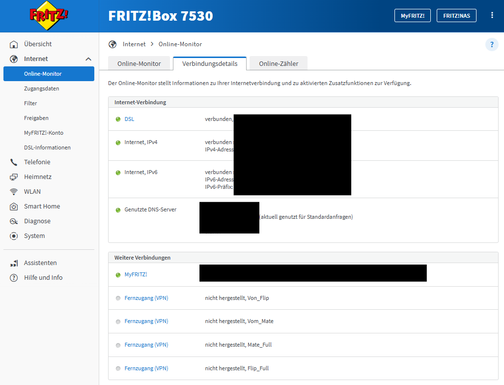
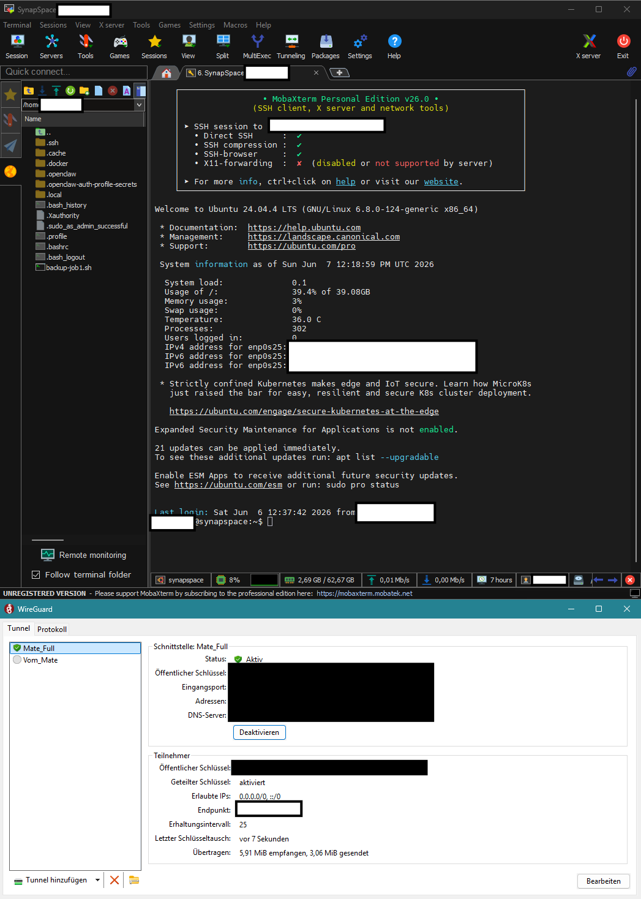
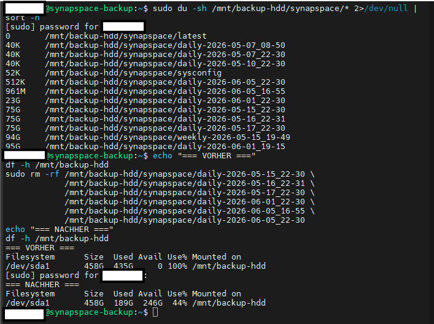
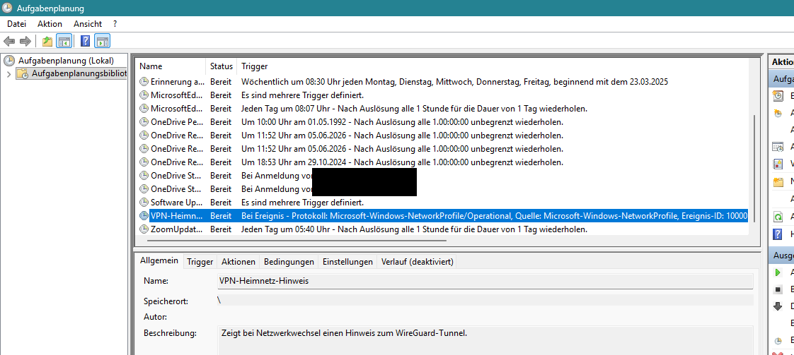
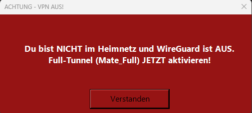

# PHASE_4.5 – Härtung, Remote-Zugriff, Coach-Architektur & Datensicherung
**Status: ✅ ABGESCHLOSSEN** (Betriebs-/Security-Strang) – inkl. Vor-Ort-Schultest WireGuard (12.06.2026)
**Zeitraum:** 2026-05-28 bis 2026-06-12 | **Aufwand:** ~20 h (kumuliert, mehrere Sessions)

> Betriebs-/Security-Strang parallel zum Feature-Phasenplan. Enthält Systemhärtung, eine größere Architektur-Umentscheidung (Coach-Engine), einen Doku-Konsistenz-Durchgang, die Verifikation des externen Zugriffs sowie Wartung/Reparatur und Ausbau der Datensicherung.
> **Hinweis:** Die ursprünglich hier geplanten Schritte „MCP-Brücke" und „externe Härtung der Brücke" sind Feature-/Integrationsarbeit und wurden nach **Phase 5/6** (Hybrid-System) verschoben.

---

## Schritte
1. ✅ Systemhärtung (SSH, UFW, OpenClaw-Loopback, 24/7-Betrieb, Auto-Updates, LVM-Reserve)
2. ✅ Coach-Engine-Entscheidung (lokaler Agent → Mistral Vibe Cloud)
3. ✅ Dauer-Doku nachziehen + Doku-Governance
4. ✅ Externe Erreichbarkeit gewährleisten & verifizieren (DualStack + WireGuard/SSH; Vor-Ort-Schultest 12.06. durchgeführt)
5. ✅ Backup-System: Wartung & Reparatur (Hauptserver-Job) + DevNode-Datenschutz (VPN-Hinweis-Tool, Cryptomator)
6. ✅ DevNode → BackupNode ins Backup-Schema (verschlüsselter „Wertvoll"-Tresor, versioniert)

---

## Schritt 1: Systemhärtung
**Status: ✅ COMPLETE** – per Reboot-Test verifiziert

- **SSH key-only:** Drop-in `/etc/ssh/sshd_config.d/01-hardening.conf` (PasswordAuthentication no, PermitRootLogin no, MaxAuthTries 3, LoginGraceTime 30). Ursache vorher: cloud-inits `50-cloud-init.conf` erzwang `PasswordAuthentication yes` – niedrigere Drop-in-Nummer überstimmt ihn (sshd nimmt pro Direktive das ERSTE Vorkommnis).
- **UFW:** alle Ports inkl. 22 nur auf `<HOME_SUBNET>` – keine „Anywhere"-Regeln mehr (auch keine v6). WireGuard-Clients erscheinen als LAN → bleiben erreichbar.
- **OpenClaw-Ports:** Gateway auf `127.0.0.1:18789-18790` (Loopback, nicht extern/über IPv6 exponiert). Config-Rechte: Verzeichnis 700, openclaw.json 600.
- **Betrieb:** Server läuft 24/7 (Shutdown-Cron entfernt). Wöchentlicher Reboot So 05:00 aktiviert über die Woche installierte Kernel-/Lib-Patches.
- **Auto-Updates:** unattended-upgrades aktiv (Scope `-security`), Auto-Reboot aus.
- **LVM:** lv-docker 404G → 374G verkleinert (`lvreduce -r`), ~30G VG-Reserve (`VFree`) für Snapshots vor kritischen Änderungen.

### Lessons Learned
- ⚠️ cloud-init schreibt `50-cloud-init.conf` mit `PasswordAuthentication yes` → eigener Drop-in mit niedrigerer Nummer (`01-`) überstimmt ihn (sshd nimmt pro Direktive das ERSTE Vorkommnis).
- ⚠️ Beinahe-Lockout: Passwort-Auth abschalten ohne verifizierten Key = Aussperrung. Sichere Reihenfolge: alte Session offen lassen → Key setzen → neue Session öffnen → in `auth.log` „Accepted publickey" prüfen → dann erst `PasswordAuthentication no`.
- ⚠️ Docker-published Ports (docker-proxy auf `0.0.0.0`/`[::]`) umgehen UFW → im Compose-`ports:` Bind-IP voranstellen (`127.0.0.1:` host-lokal / `<SERVER_IP>:` LAN).
- ℹ️ `reboot` stoppt Container graceful (systemd SIGTERM + Grace) → kein `compose down` nötig bei idle System.
- ℹ️ Vor kritischen Änderungen LVM-Snapshot (`lvcreate -s`); VG braucht freien Platz.

---

## Schritt 2: Coach-Engine-Entscheidung (Architektur-Umentscheidung)
**Status: ✅ COMPLETE**

### Ausgangslage (vorher)
DEX war als **lokaler** Coach auf OpenClaw/hermes geplant – passiver Bildungscoach via Telegram, später proaktiver Praxis-Trainer; Langzeitgedächtnis lokal via Qdrant. Voraussetzung dafür wäre ein teures GPU-Upgrade (24 GB VRAM für ein brauchbares 32B-Modell) gewesen.

### Auslöser der Umentscheidung – Anforderungsklärung
Drei geklärte Anforderungen entzogen dem lokalen Agenten-Framework die Kernrechtfertigung:
- **Proaktivität:** KEIN Muss. Nutzer startet Gespräche selbst (will nicht von einer KI „getrieben" werden).
- **Telegram-Zwang:** entfällt. Jedes Interface (Mistral-App o. ä.) ist ok.
- **Cloud-Gedächtnis:** für Mistral akzeptabel (EU-Server = Ausnahme von der „lokal only"-Linie).

### Recherche (NotebookLM / Gemini Deep Research)
Vier Recherche-Prompts erstellt: Mistral-Vibe (Quellensuche + Bericht), Hermes-Framework, OpenClaw (Vergleich), Gemini Deep Research (Alternativen wie Letta/AutoGen/CrewAI/Khoj). Auswertung mit Opus.

### Auswertung Mistral-Bericht (Kernpunkte)
- **Modell Medium 3.5 (256k Kontext)** schlägt jedes lokal lauffähige Modell qualitativ – das trägt das Auslagern-Argument.
- **Limits** (~150 Nachrichten/Tag) reichen für mehrere Check-ins + Coaching.
- **Persistenz** über Libraries/Projekte/Custom Instructions (nicht über Legacy-„Memories").
- **MCP** als Brücke zum lokalen System.
- **Gotcha:** API ist NICHT im Abo (separat abgerechnet) → ein n8n→Mistral-API-Weg (Weg B) kostet extra. Preis-Konsens Medium 3.5 ≈ **$1,50 In / $7,50 Out** pro 1M Token (der früher genannte $0,40-Wert war falsch).
- **Chat-Modus läuft aus** → in Work bauen.
- Offener Punkt damals (Studenten-Verifizierung) – später geklärt: **Education = voller Pro-Umfang**, No-Telemetry aktiv. **Abo 12 Monate im Voraus bezahlt (68,43 €).**
- Methodische Lesson: KI-Rechercheberichte kritisch lesen – Fakten verwerten, euphorische Wertungen („Gamechanger") selbst einordnen.

### Entscheidung
- **Coach „DEX" = Mistral Vibe (Cloud, Weg A).** Persona „DEX" via Projekt-Custom-Instructions. Kein lokales Agenten-Framework und kein GPU-Upgrade im MVP nötig.
- **Weg B** (eigener Orchestrator + Mistral-API) und **OpenClaw/Hermes** → Post-MVP/Fallback (API kostet extra).
- Mistral Nemo 12b als DEX-Motor war zuvor schon verworfen; mit dem Cloud-Coach ist die lokale Motor-Frage für DEX gegenstandslos.

### Ziel-Architektur (drei Schichten)
1. **Cloud-Coach + spezialisierte Tutoren** (Mistral Vibe): Check-ins, Strategie, ROI-Priorisierung, Routing; fachspezifische Tutor-Chats (z. B. Sandbox-Begleitung) im selben Projekt (geteiltes Wissen).
2. **Lokaler Orchestrator** (n8n): empfängt Aufträge des Coaches, steuert Workflows, meldet Ergebnisse zurück.
3. **Lokale Produktion/Infrastruktur:** Ollama (Material-Generierung), Qdrant (Copyright-RAG), Sandbox (fehlerhafte VMs).
- **Brücke = MCP:** n8n als MCP-Server, Vibe als MCP-Client; Tool-Antworten fließen ins Reasoning des Coaches. Lange Generierung läuft **asynchron** (Tool-Timeout ~60 s → Auftrag annehmen, Ergebnis separat melden).

### Datenhaltung / Vertraulichkeit
- **Copyright-Fachliteratur strikt lokal** (Qdrant) – Mistrals Vertraulichkeitsmatrix bestätigt: „Secret" = keine Cloud.
- **Lernprofil DARF in die Cloud** (EU-Vertrauen), liegt aber lokal aus Praktikabilität (auto-Pflege via MCP).

### OpenClaw – Rolle nach der Umentscheidung
Kein zwingender, einzigartiger Use Case mehr (n8n + Mistral decken Coach, Benachrichtigungen, Material ab). Einziger Nischenkandidat: Sandbox-Szenario-Builder. Entscheidung daran gekoppelt, nicht erzwungen. Läuft bis dahin auf Loopback mit (kostet nichts). OPENCLAW_REFERENZ.md aus dem Projektwissen auf den DevNode archiviert.

### Lessons Learned
- ℹ️ Anforderungen zuerst hart klären (Proaktivität? Telegram? Gedächtnis?) – sie entscheiden die Architektur, nicht die Technik-Vorliebe.
- ℹ️ Cloud kann lokal qualitativ schlagen UND günstiger sein, wenn EU-Souveränität gegeben ist (Mistral).

---

## Schritt 3: Dauer-Doku nachziehen + Doku-Governance
**Status: ✅ COMPLETE**

Konsistenz-Durchgang über alle Dauer-Dokumente, damit jeder Chat eindeutig erkennt, was aktueller Plan und was Historie ist:
- **PROJEKT_DECISIONS.md:** Coach = Mistral Vibe (Weg A), MCP-Brücke, Gedächtnis lokal, OpenClaw/Hermes Post-MVP, „Mistral Nemo verworfen"; Perplexity entfernt; neue **Tool-Souveränität**-Zeile; DEX-Telegram-/Nutzungskonzept-Zeilen als historisch. **Neu:** Dokumenten-Landkarte (Verantwortungsmatrix) am Kopf.
- **Projektziele_MVP.md:** DEX = Cloud-Coach; Tool-Souveränität (nur lokal/Open-Source/Mistral); Boardmix-Ausnahme (Whiteboard, keine KI); Claude = Build-Partner außerhalb des Ökosystems; alte Tool-/Telegram-Stellen historisch markiert.
- **PHASE_2.md:** fehlerhaftes „Vodafone Kabel" auf „Vodafone DSL" korrigiert; DS-Lite klar als Phase-2-Stand + „✅ GELÖST in Phase 4.5".
- **PROJEKT_STATIC.md:** TP-Link TL-SG105 + Lern-Tablet (Tab S6 Lite) ergänzt; Z-Flip-Apps auf Mistral/Open-WebUI/Anki; Mistral-Abo (68,43 €) + Claude-Pro-Aufbau-Anteil; Lerncoach-Integration auf Mistral/DEX umgeschrieben; Blueprint-Restinfos (Switch, Eval-Kandidaten) übernommen.
- **Historie-Banner** auf -Anforderungsanalyse.md, +Ist-Zustand.md, Future_Hardware_Integration.md gesetzt.
- **SSoT_Architektur-Blueprint.md** aus dem Projektwissen entfernt (Restinfos vorher nach PROJEKT_STATIC übertragen).
- **Tool-Souveränität** projektweit verankert: Lernökosystem nur lokal/Open-Source/Mistral; **NotebookLM** ist **kein** Ökosystem-Tool mehr, dient aber weiterhin dem **Deployment** (→ NotebookLM_Briefing als Deployment-Werkzeug klassifiziert).

---

## Schritt 4: Externe Erreichbarkeit gewährleisten & verifizieren
**Status: ✅ VERIFIZIERT** (inkl. Vor-Ort-Schultest 12.06.)

### Ausgangslage
Heimanschluss war DS-Lite (keine öffentliche IPv4 → Server extern nur per IPv6; IPv4-only-Netze wie Schul-WLAN kamen nicht durch). **DualStack / öffentliche IPv4 bei Vodafone aktiviert** (Anfrage via WhatsApp-Support, seit 04.06.2026) → DS-Lite-Blocker weg.

### FritzBox-Verifikation (von zu Hause)
- **Öffentliche IPv4 ✅** – echte öffentliche Adresse (kein CGN-Bereich 100.64–100.127); DualStack (IPv4 **und** IPv6 verbunden).
- **MyFRITZ aktiv ✅** – eigene `…myfritz.net`-Adresse (fester „Türname" nach Hause; folgt automatisch IP-Wechseln).
- **WireGuard ✅** – Fernzugang-Profile in der FritzBox konfiguriert (Smartphone + Laptop, Split- und Full-Tunnel); inaktiv = normal.
- **Keine Exposition ✅** – keine Portfreigabe, kein Exposed Host, keine Weiterleitung auf `<SERVER_IP>`. „Selbstständige Portfreigabe" (UPnP) deaktiviert.
- **FritzBox-Fernzugang ✅** – HTTPS-Internetzugriff auf die FritzBox-Oberfläche aus (UI nicht exponiert).

Der FritzBox-Online-Monitor belegt die neue Anschlusslage – DualStack aktiv, MyFRITZ erreichbar, die vier WireGuard-Profile angelegt (inaktiv):

### End-to-End-Test
- SSH über WireGuard (Profil **Mate_Full**) auf `<SERVER_IP>` **erfolgreich** – Test über **Mobilfunk** (Handy-WLAN aus, damit echter Außen-Weg statt heimnetz-durchgereicht).
- Über den Tunnel erscheint der Client als LAN → SSH erlaubt (UFW Port 22 nur `<HOME_SUBNET>`). Es wurde **kein** Port nach außen geöffnet.

Der SSH-Zugriff über den aktiven Tunnel aus dem Mobilfunknetz – der Beleg für den echten Außen-Zugang ohne offene Portfreigabe:

### Vor-Ort-Schultest (12.06.2026 – Ergebnis)
- WireGuard (Profil **Mate_Full**, FritzBox-WG) aus dem **Schul-WLAN** baut **nie** einen Handshake auf (Log nur „Sending handshake initiation", nie „Receiving"). Identisches Profil/Endpunkt `<WIREGUARD_ENDPOINT>:<WIREGUARD_PORT>` über **Mobilfunk** → Handshake sofort, Full-Tunnel trägt.
- Der Endpunkt ist die öffentliche **IPv4** → **kein** IPv6-/DS-Lite-Problem, sondern das **Schulnetz lässt den ausgehenden WG-Weg (UDP `<WIREGUARD_PORT>`) nicht durch** (ob portspezifisch oder generell UDP/VPN: offen). SSH über den Tunnel ist aus diesem Netz damit ebenfalls nicht nutzbar.
- Damit ist die **reine IPv4-Strecke bewiesen** (Mobilfunk erreichte den IPv4-Endpunkt); der frühere Vorbehalt „IPv4-Strecke noch nicht zu 100 % bewiesen" ist erledigt.
- **Reserve (noch nicht verifiziert): NetBird** (self-hosted, Berlin; relayfähig) für netzunabhängigen Zugriff aus IPv4-/restriktiven Netzen; **DEX/Telegram** bleibt netzunabhängiger Fallback.

### Lessons Learned
- ℹ️ DS-Lite: nur IPv6 extern; IPv4-only-Netze kommen nicht durch. DualStack/öffentliche IPv4 löst das. Mobilfunk hat meist IPv6.
- ℹ️ „DualStack erhalten" ≠ „Remote-Zugang verifiziert": End-to-End-Test (WireGuard + SSH aus dem Zielnetz) ist Pflicht; Schul-/Firmen-WLANs können VPN-Ports blockieren (12.06. bestätigt: Schul-WLAN lässt ausgehend UDP `<WIREGUARD_PORT>` nicht durch).
- ℹ️ End-to-End-Außen-Test über **Mobilfunk** (Handy-WLAN aus) – ein über Heim-WLAN durchgereichter Hotspot beweist den Außen-Zugriff nicht.
- ℹ️ DSL-Resync-Schleife (FritzBox „Power/DSL" blinkt): Ereignisprotokoll zeigt „DSL-Synchronisierung verloren → Training → verfügbar"-Zyklen; Störabstandsmarge prüfen (Richtwert ≥ 6 dB). Reihenfolge: Kabel/Stecker nachsetzen → Störsicherheit „max. Stabilität" → Anbieter. Ein Einzelleitungs-Fehler erscheint NICHT im flächigen Störungsmelder. (Status: 07.06. aufgetreten, in Beobachtung.)

---

## Schritt 5: Backup-System – Wartung & Reparatur + DevNode-Datenschutz
**Status: ✅ COMPLETE**

### Backup-Job-Reparatur (Hauptserver)
Backups schlugen seit 01.06. fehl (Platte 100 % voll; davor im Mai „Broken pipe" durch schlafenden Node). Zwei Ursachen in `/usr/local/bin/backup-job1.sh`:
- **Falscher Modell-Ausschluss:** `--exclude=ollama/models/` passte auf keinen Pfad (Backup-Quelle ist `/var/lib/docker/volumes/`, Modelle liegen unter `synapspace_ollama_data/_data/models/`) → ~95 GB Modelle liefen bei jedem Lauf mit. Korrigiert: `--exclude=/synapspace_ollama_data/_data/models/ --exclude=*.tmp --exclude=backingFsBlockDev`.
- **Fehl-Läufe blieben liegen:** unfertige Verzeichnisse wurden im Fehlerfall nicht entfernt. Korrigiert: Else-Zweig löscht den Teil-Stand (`rm -rf …/${TYPE}-${TIMESTAMP}`).
- Aufgeräumt: ~249 GB Fehl-Stände + 2 alte modellbehaftete Stände → Platte 100 % → 44 %. Testlauf erfolgreich (Zähler 9, modellfrei, schnell). Die GVS-Rotation selbst war korrekt – sie versagte nur, weil nicht aufgeräumte Fehl-Stände die „neuesten N"-Plätze belegten.
- Einspielen per SFTP (Original als `.bak` gesichert).

Die Backup-Platte vor und nach dem Aufräumen der Fehl-Stände:

### Backup-Node-Plattenlayout (live entdeckt – war nicht dokumentiert)
- **sda** 466 GB externe HDD → `/mnt/backup-hdd` = **Server-Backups**.
- **sdb** 112 GB interne SSD: `/boot`, `/` (OS, ~7–9 GB belegt) und **sdb4 ~80 GB → `/mnt/backup/ssd`** = **Client-Backups** (war leer).
- Entscheidung: Server → HDD, Client (DevNode) → SSD. **Kein Repartitionieren** (kein Bedarf; Live-Shrink der Root-Partition riskant; Ausweg: Client-Backup notfalls auf die HDD zeigen).

### VPN-Hinweis-Tool (DevNode, Eigenbau)
Erinnert daran, unterwegs den WireGuard-Full-Tunnel zu aktivieren.
- Ereignisgesteuerte **Aufgabenplanung**-Aufgabe „VPN-Heimnetz-Hinweis" (Trigger: NetworkProfile/Operational, EventID 10000 = „Netzwerk verbunden") ruft `C:\Tools\VPN-Hinweis\Check-Heimnetz.ps1`.

Die ereignisgesteuerte Aufgabe in der Windows-Aufgabenplanung (Trigger Ereignis-ID 10000 statt Dauer-Polling):

- Skript erkennt Heimnetz (physische IP im `<HOME_SUBNET>` **oder** WireGuard-Adapter „Up") vs. unterwegs und zeigt auf **allen** Monitoren ein Vordergrund-Fenster (grün „Heimnetz erkannt" / rot „ACHTUNG – VPN AUS!"); ein Klick schließt alle.

Das Hinweis-Fenster im Außen-Fall (kein aktiver Tunnel):

- **Stufe 1** (Erinnerung) final; **Stufe 2** (automatisches Tunnel-An/Aus) bewusst aufgeschoben (Adminrechte zur Laufzeit, versionsabhängige WG-Befehle, mehr Sonderfälle; „laut + von dir bestätigt" ist bei einer Sicherheitsfunktion sicherer als „still + automatisch").

### Cryptomator (DevNode)
- Alle in die Cloud gehenden Daten **verschlüsselt** (Cryptomator arbeitet transparent → Mehraufwand ~0 → „alles verschlüsseln").
- Zwei Tresore in OneDrive: **„01_Wertvoll"** (wertvoll → OneDrive + Backup-Node) und **„Rest"** (nur Cloud).
- Passphrase **+ Recovery-Key** getrennt aufbewahrt (Papier offline + Passwortmanager).
- EU-/souveräne Alternativen recherchiert (Filen, Proton Drive, Nextcloud self-host) → Post-MVP. Boardmix-Ausnahme bleibt.

### Lessons Learned
- ⚠️ rsync-`--exclude` muss zum **Quellpfad** passen (relativ zur Backup-Quelle) – falscher Pfad = Ausschluss greift nicht (95 GB Modelle liefen mit → Platte voll).
- ⚠️ Fehl-Läufe müssen sich **selbst aufräumen** (Teil-Stand im Fehler-Zweig löschen), sonst Platte voll + Rotation blockiert (Fehl-Stände belegen die „neuesten N").
- ℹ️ Verschlüsseltes Backup: Cryptomator-Tresor sichern = Daten vollständig sichern; zum **Lesen** nach Restore zusätzlich Passphrase/Recovery-Key nötig → getrennt aufbewahren.
- ℹ️ Ereignisgesteuerte Aufgabe (EventID 10000) statt Dauer-Polling – kein hängender Dauerprozess (alter AutoHotkey-Unfall).
- ℹ️ Geplante Aufgabe verweist auf einen festen Skriptpfad → Skript nicht verschieben/löschen, sonst läuft die Aufgabe still ins Leere.

---

## Schritt 6: DevNode → BackupNode ins Backup-Schema
**Status: ✅ COMPLETE** (war Phase-2-Altlast)

- Gesichert wird der **verschlüsselte** „Wertvoll"-Tresor → die Node-Kopie ist ebenfalls verschlüsselt at rest (selbst bei SSD-Diebstahl nichts lesbar). Nur „Wertvoll", nicht „Rest".
- **Ziel:** `/mnt/backup/ssd/devnode/wertvoll/` (chown `<USER>`).
- **Aufbau:** `current/` = Spiegel (rsync `--delete`); daneben datierte **Hardlink-Schnappschüsse** `v-DATUM/`. **3 rollierende Versionen** – beim 4. fällt die älteste weg. Hardlinks: jeder Stand ist vollständig, kostet aber nur den Platz geänderter Dateien.
- **Node-Skript:** `/home/<USER>/scripts/devnode-snapshot.sh` (`cp -al current v-DATUM` + Rotation auf 3).
- **DevNode-Starter:** `C:\Tools\Wertvoll-Backup\backup-wertvoll.sh` – rsync `-rt --delete` vom OneDrive-Tresor nach `current/`, dann SSH-Trigger des Node-Skripts. Läuft im **lokalen MobaXterm-Terminal** (bringt rsync/ssh mit).
- **Ein-Klick:** gespeicherte MobaXterm-Session „Wertvoll-Backup" + Desktop-Verknüpfung (Terminal sichtbar, MobaXterm bleibt beim Schließen offen).
- **Manuell/wöchentlich**, keine Automatik: Laptop + Node nur zeitweise an → automatisches Nacht-Backup + Selbst-Wecken bewusst verworfen (beide Geräte müssten gleichzeitig wach sein; Wecken geht nur aus Schlaf, nicht aus Aus).
- Passwortfreier SSH DevNode → Node bestätigt.
- **Restore-Test bestanden:** eine Version vom Node nach `C:\Restore-Test\` zurückkopiert, in Cryptomator mit Passwort geöffnet, Inhalt vollständig → echte Wiederherstellbarkeit bewiesen.
- Ergebnis: **3-2-1** für wertvolle Daten (DevNode-Original + OneDrive-verschlüsselt + Node-verschlüsselt, 3 Zeitstände).

### Lessons Learned
- ℹ️ **Hardlink-Schnappschüsse** (`cp -al` / `--link-dest`): jeder Stand ist vollständig und allein wiederherstellbar, kostet aber nur den Platz geänderter Dateien (≠ Diff-Kette, die alle Glieder braucht).
- ℹ️ MobaXterm-lokales Terminal: Windows-Laufwerk = `/drives/c/...`; für Windows-Quellen `-rt` statt `-a` (keine Unix-Rechte); CRLF-Zeilenenden in `.sh` mit `sed 's/\r$//'` entfernen, sonst stolpert bash.
- ℹ️ Laptop kann sich per Aufgabenplanung nur aus Schlaf/Ruhezustand wecken, nicht aus dem Aus → Nacht-Automatik unzuverlässig; bewusst Ein-Klick-Backup gewählt.
- ℹ️ **Restore-Test** ist die einzige echte Bestätigung: eine Version zurückkopieren und mit Passwort öffnen.
- ℹ️ Backup-Node-Uhr lief 2 h hinter (vermutlich UTC) – Schnappschuss-Namen sortieren trotzdem korrekt; Zeitzone bei Gelegenheit angleichen.

---

## Konfigurationen (Phase-4.5-Stand)
- SSH: key-only via `01-hardening.conf` (überstimmt cloud-inits `50-cloud-init.conf`)
- UFW: alle Ports nur `<HOME_SUBNET>`
- OpenClaw: Loopback-Binding `127.0.0.1:18789-18790`, Rechte 700/600
- Betrieb: 24/7 + Reboot So 05:00; unattended-upgrades (`-security`)
- LVM: lv-docker 374G, ~30G VFree-Reserve
- Anschluss: Vodafone DSL mit DualStack / öffentlicher IPv4
- WireGuard (FritzBox): 4 Profile (Von_Flip, Vom_Mate=Split, Mate_Full=Full, Flip_Full); SSH über Tunnel verifiziert
- backup-job1.sh: Modell-Ausschluss korrigiert (`/synapspace_ollama_data/_data/models/`) + Fehl-Lauf-Aufräumung
- Backup-Node-Platten: HDD `/mnt/backup-hdd` (Server) · SSD `/mnt/backup/ssd` (Client)
- DevNode-Backup: `/mnt/backup/ssd/devnode/wertvoll/{current, v-DATUM}`; Node-Skript `/home/<USER>/scripts/devnode-snapshot.sh`; Starter `C:\Tools\Wertvoll-Backup\backup-wertvoll.sh`
- VPN-Hinweis: `C:\Tools\VPN-Hinweis\Check-Heimnetz.ps1` + Aufgabe „VPN-Heimnetz-Hinweis"
- Cryptomator: zwei Tresore in OneDrive („01_Wertvoll" + „Rest")
