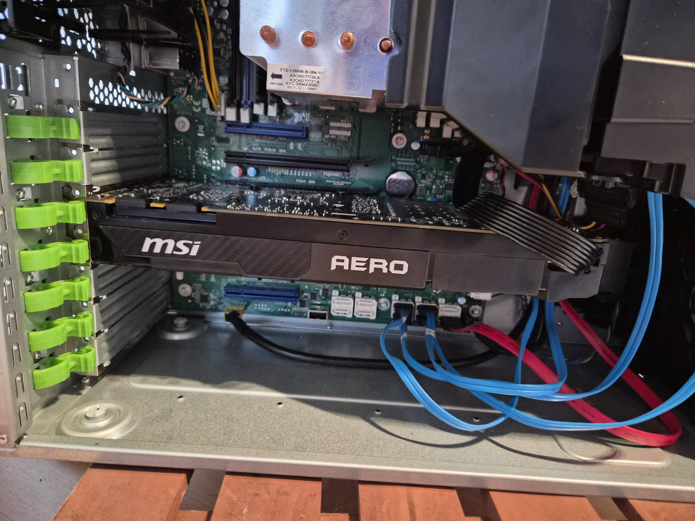
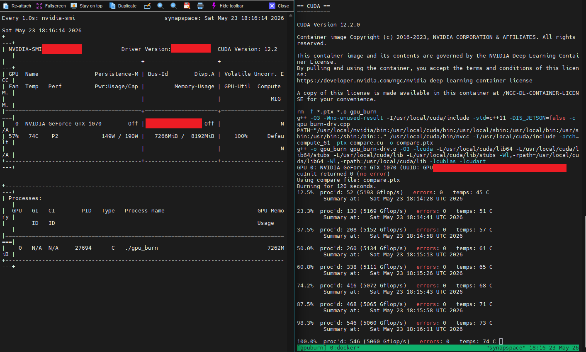
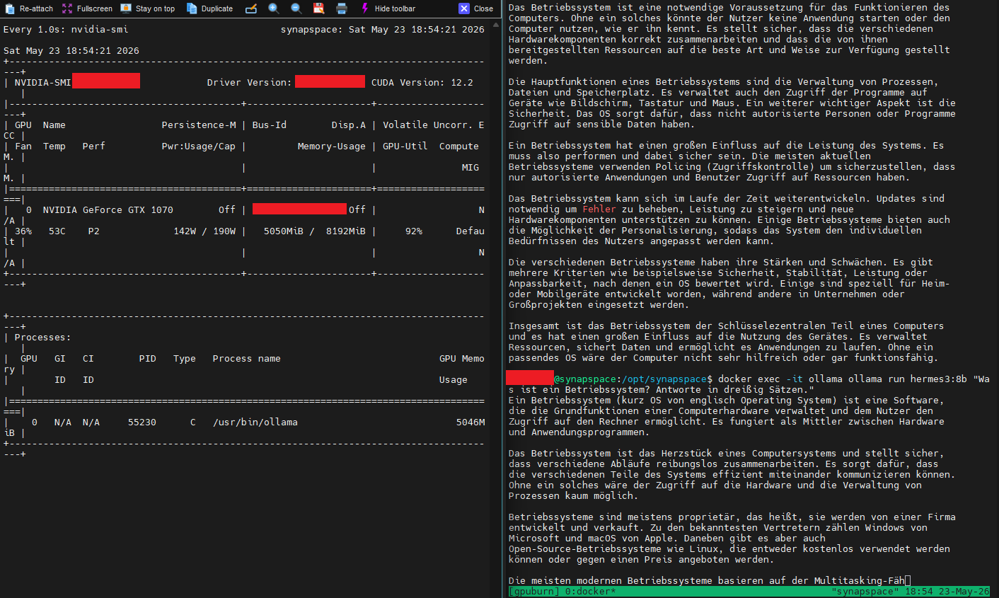
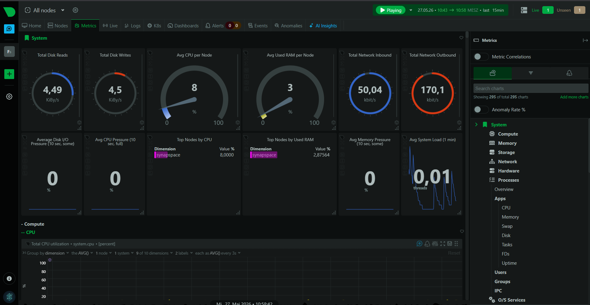

# Phase 4 – GPU-Integration & Optimierung

**Status:** ✅ Abgeschlossen
**Zeitraum:** 2026-05-16 bis 2026-05-27 | **Aufwand:** ~10h

In dieser Phase habe ich den Server von reinem CPU-Betrieb auf GPU-beschleunigte Inferenz umgestellt, ein Echtzeit-Monitoring eingerichtet und den lokalen Agenten DEX feingetunt. Damit erreicht das System den ersten praktisch nutzbaren Stand für tägliche Lerninteraktionen.

---

## Überblick der Arbeitsschritte

1. GTX 1070 8GB testen und einbauen
2. Layer-Splitting verifizieren (8GB VRAM + 64GB ECC-RAM)
3. Netdata-Monitoring einrichten
4. Modelfile konfigurieren (`hermes3:8b-dex`)
5. OpenClaw/DEX-Feintuning (SOUL.md + openclaw.json)
6. RAG-Pipeline vorbereiten → Übergabe an Phase 5

---

## Schritt 1: GTX 1070 testen und einbauen

Die ursprünglich verbaute Quadro K2200 (Compute 5.0) ist mit Ollama in Docker inkompatibel. Ich habe sie durch eine gebrauchte **MSI Aero GTX 1070 8GB OC** (Compute 6.1) ersetzt. Bei Gebraucht-Hardware prüfe ich grundsätzlich zuerst die Funktion, bevor ich sie ins Produktivsystem einbaue.

**Test vor dem Einbau (am Dev-Node, Windows):**
- GPU-Z: 8192 MB VRAM verifiziert, echte GTX 1070 (keine OEM-Variante)
- FurMark: 20 Minuten Volllast – keine Artefakte, stabile Frameraten

Der Celsius M740b benötigt für die Stromversorgung der Karte ein PCIe-6+2-auf-8-Pin-Adapterkabel – ein Detail, das ich vorab geprüft und bestellt habe.

So sieht die eingebaute Karte im Server aus:



**Stresstest im eingebauten Zustand:** Mit `gpu-burn` in einem CUDA-Docker-Container habe ich die Karte unter Last verifiziert.



- `COMPUTE=61`, 120 Sekunden, **0 Fehler**
- Peak-Temperatur: 74°C
- Performance: ~5060 Gflop/s

Anschließend habe ich den `deploy`-Block in der `docker-compose.yml` aktiviert und damit den GPU-Passthrough an den Ollama-Container freigegeben:

```yaml
deploy:
  resources:
    reservations:
      devices:
        - driver: nvidia
          count: all
          capabilities: [gpu]

healthcheck:
  test: ["CMD-SHELL", "ollama list || exit 1"]
```

Dass Ollama die GPU tatsächlich nutzt, zeigt die Auslastung von 92% beim Modell `hermes3:8b`:



---

## Schritt 2: Layer-Splitting verifizieren

Ollama verteilt Modell-Layer automatisch zwischen VRAM und ECC-RAM, je nach verfügbarem Speicher. Ich habe das für alle installierten Modelle nachvollzogen (`docker exec -it ollama ollama ps`):

| Modell | VRAM | RAM | GPU-Anteil |
|--------|------|-----|-----------|
| hermes3:8b (4.7GB) | vollständig | – | 100% GPU |
| qwen2.5:7b (4.7GB) | vollständig | – | 100% GPU |
| mistral-nemo:12b (7.1GB) | 6.6GB | 0.5GB | ~93% GPU |
| command-r:35b | hybrid | hybrid | ~23% GPU |
| qwen2.5:32b | hybrid | hybrid | ~42% GPU |
| llama3.1:70b | – | vollständig | CPU-only |

Die 8B- und 7B-Modelle laufen vollständig auf der GPU und sind damit für reaktive Chat-Sessions schnell genug. Die großen Modelle (35B–70B) bleiben für asynchrone Hintergrund-Workflows reserviert, bei denen Laufzeit unkritisch ist.

---

## Schritt 3: Netdata-Monitoring einrichten

Für die Systemstabilität habe ich **Netdata** als Open-Source-Echtzeit-Monitoring ergänzt (CPU, RAM, Disk, GPU, Docker-Container). Ich habe mich bewusst gegen Prometheus + Grafana entschieden – Netdata bietet bei minimalem Konfigurationsaufwand sofort nutzbare Dashboards.

**Konfiguration:**
- Image: `netdata/netdata:latest` (Rolling Release – Netdata Cloud erfordert aktuelle Version)
- Netzwerk: `network_mode: host` (das Bridge-Netzwerk hatte DNS-Auflösungsprobleme bei der Cloud-Verbindung)
- Port: 19999
- Netdata Cloud verbunden (persönlicher Account)
- Dashboard: `http://<SERVER_IP>:19999`

```yaml
netdata:
  image: netdata/netdata:latest
  container_name: netdata
  restart: unless-stopped
  network_mode: host
  cap_add:
    - SYS_PTRACE
    - SYS_ADMIN
  security_opt:
    - apparmor:unconfined
  volumes:
    - netdata_config:/etc/netdata
    - netdata_lib:/var/lib/netdata
    - netdata_cache:/var/cache/netdata
    - /etc/passwd:/host/etc/passwd:ro
    - /etc/group:/host/etc/group:ro
    - /proc:/host/proc:ro
    - /sys:/host/sys:ro
    - /etc/os-release:/host/etc/os-release:ro
    - /var/run/docker.sock:/var/run/docker.sock:ro
```

Da Docker UFW umgeht, war zusätzlich eine permanente `DOCKER-USER`-Regel (`172.0.0.0/8 RETURN`) in `/etc/ufw/after.rules` nötig.

Das fertige Dashboard mit CPU-, RAM- und GPU-Übersicht:



---

## Schritt 4: Modelfile konfigurieren

Für den Agenten DEX habe ich ein Custom-Modell `hermes3:8b-dex` auf Basis von `hermes3:8b` erstellt. Die Parameter sind auf konsistente, sachliche Antworten ausgelegt:

```
FROM hermes3:8b
PARAMETER temperature 0.3
PARAMETER top_p 0.9
PARAMETER repeat_penalty 1.1
PARAMETER num_ctx 8192
```

Den `SYSTEM`-Parameter habe ich bewusst **nicht** im Modelfile gesetzt – er kollidiert mit der SOUL.md-Injection von OpenClaw. `PARAMETER think false` ist zudem kein gültiger Ollama-Modelfile-Parameter.

---

## Schritt 5: OpenClaw/DEX-Feintuning

Das Feintuning des Agenten war der aufwändigste Teil dieser Phase. Die zentrale Erkenntnis: Bei einem 8B-Modell ist die **Länge des System-Prompts kritisch**.

**SOUL.md (~750 Zeichen):** Eine kurze SOUL.md ist bei `hermes3:8b` Pflicht. Längere Varianten (>~1000 Zeichen) triggern zuverlässig einen Template-Bug, der zu aggressivem Tool-Calling bei einfachen Konversationsfragen führt. Inhalt: Sprache (Deutsch/du), Tonalität mit konkreten Beispiel-Ankern, klare Verbote.

**openclaw.json (Zielkonfiguration):**

```json5
tools: {
  profile: "minimal",
  deny: ["group:fs", "exec", "process", "browser", "cron", "gateway", "sessions_spawn"],
  allow: ["memory_search", "memory_get", "message"],
  exec: { security: "deny" },
  elevated: { enabled: false },
  loopDetection: { enabled: true, criticalThreshold: 10 }
},
agents: {
  defaults: {
    bootstrapTotalMaxChars: 60000
  }
}
```

**Modell-Evaluierung für den DEX-Motor:**

| Modell | Ergebnis |
|--------|---------|
| `hermes3:8b` | Tool-Calling-Bug bei langem System-Prompt |
| `hermes3:8b-dex` | ✅ Aktiv – funktioniert mit kurzer SOUL.md + tools-Config |
| `interstellarninja/hermes-3-llama-3.1-8b-tools` | ❌ Inkompatibel: `think:false` wird nicht gesendet → leere Antworten |
| `hermes-tools-dex` (custom) | ❌ OpenClaw löst intern auf Basis-Modell auf → selbes Problem |

Die offenen Bugs habe ich mit ihren Ursachen und Workarounds separat dokumentiert (Template-Bug bei langem Prompt, fehlendes `think:false` bei thinking-fähigen Modellen, `minimal`-Profil das `group:fs` durchlässt).

---

## Schritt 6: RAG-Pipeline vorbereiten

Die Grundlagen für die RAG-Pipeline stehen: Qdrant läuft (Port 6333) und Command-R 35B ist als RAG-Spezialist installiert. Die eigentliche Pipeline-Konfiguration über n8n-Workflows erfolgt in **Phase 5**.

---

## Lessons Learned

### GPU & Hardware
- FurMark + GPU-Z immer **vor** dem Einbau – so verifiziere ich Gebraucht-Hardware (Temperaturen, Artefakte, VRAM)
- `gpu-burn` im Docker-Container (`nvidia/cuda:12.2.0-devel`) ist ein zuverlässiger Stresstest für die eingebaute GPU
- PCIe-Kabelkompatibilität vorab prüfen – der Fujitsu M740b braucht einen 6+2-auf-8-Pin-Adapter
- Erdung: Netzkabel ziehen + Heizungsrohr als Erdungspunkt genügt
- Layer-Splitting läuft vollautomatisch über Ollama – das VRAM-Limit wird nicht manuell konfiguriert

### Netdata
- Im Bridge-Netzwerk treten DNS-Auflösungsprobleme auf → `network_mode: host` löst das zuverlässig
- Die `DOCKER-USER`-Regel (`172.0.0.0/8 RETURN`) muss **permanent** in `/etc/ufw/after.rules` stehen, nicht nur temporär gesetzt werden

### OpenClaw & DEX
- Die SOUL.md-Länge ist der Haupttrigger für den Tool-Calling-Bug → konsequent unter 800 Zeichen halten
- Konkrete Ton-Anker-Beispiele wirken besser als abstrakte Beschreibungen
- `tools.profile: "minimal"` allein reicht nicht – `deny: ["group:fs"]` immer explizit setzen
- Ollama-baseUrl **ohne** `/v1`-Suffix – sonst brechen Tool-Calls unter Streaming ab
- OpenClaw-Provider-Prefix `ollama/` ist zwingend, sonst Fallback auf `openai/`
- `python3 -m json.tool` nach jeder JSON-Änderung spart lange Fehlersuche
- 8B-Modelle haben begrenzte Persona-Treue – mit 30B-Modellen deutlich besser
