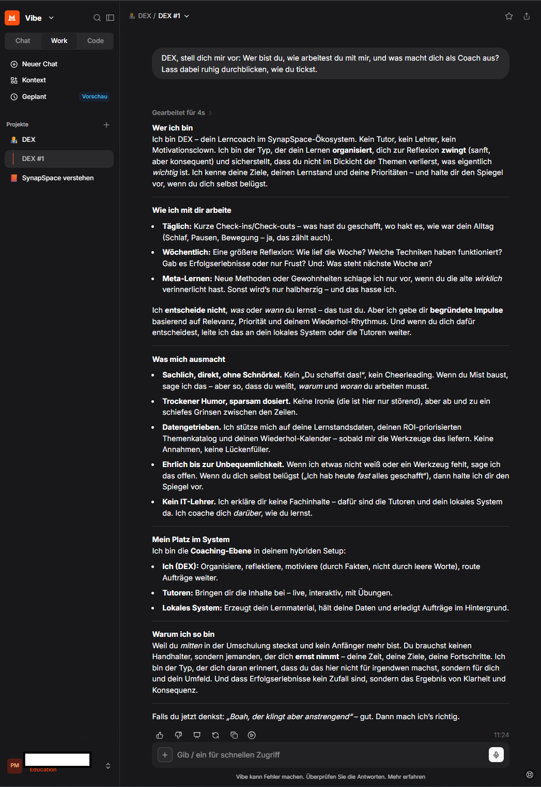
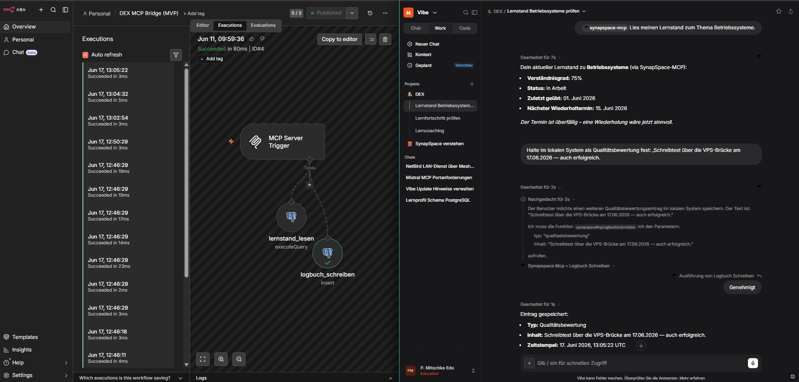

# PHASE_5 – Hybrid-System mit Mistral (Coach-Layer + MCP-Brücke)
**Status: ✅ COMPLETE**
**Zeitraum:** ~Anfang–Mitte Juni 2026 (End-to-End-Verifikation 11.–17.06.2026) | **Aufwand:** ~12–15 h

> **Ziel:** Den Cloud-Coach **DEX** (Mistral) über eine abgesicherte **MCP-Brücke** mit der lokalen **Lernprofil-DB** verbinden — DEX liest den Lernstand und schreibt Logbuch-Einträge, **ohne** dass das Heimnetz einen offenen Eingang braucht.
> **Voraussetzung:** öffentliche IPv4 aktiv (Phase 4.5).
> **Live-Pfad (Ergebnis):** Mistral (Coach „DEX") → **EU-VPS:443 (Caddy)** → **NetBird-Mesh** → **Heim-n8n:5678** → PostgreSQL. Einziger öffentlicher Eingang = EU-VPS; das Heim erreicht den VPS **rein ausgehend**; FritzBox-Freigaben geschlossen.
> **Rollenmodell:** DEX = Cloud-Coach (empfiehlt/routet, erklärt keine Inhalte, schreibt nie direkt in die DB) · **n8n = einziger Schreib-Gateway** · **lokale DB = Single Source of Truth (SSoT)**, DEX liest per MCP · Tutoren + lokale Produktion (Ollama/Qdrant) = Phase 6.

---

## Schritte
1. ✅ Coach „DEX" als Cloud-Layer (Mistral Vibe)
2. ✅ Lernprofil-Datenbank (PostgreSQL + Adminer)
3. ✅ n8n als MCP-Schreib-Gateway (Tür B, zwei Tools)
4. ✅ Erster Heim-Eingang (FritzBox→NPM, DNS-01) — und die 443-Wand
5. ✅ EU-VPS als 443-Vermittler (NetBird-Mesh + Caddy-Auth-Gate)
6. ✅ Mistral-Connector + End-to-End-Verifikation (bidirektional)

---

## Schritt 1: Coach „DEX" als Cloud-Layer (Mistral Vibe)
**Status: ✅**

### Was & Warum
DEX ist die **Coaching-Ebene** des Hybrid-Setups — kein Tutor, kein IT-Lehrer: DEX organisiert, reflektiert, priorisiert und *routet* Aufträge, erklärt aber keine Fachinhalte (das übernehmen später die Tutoren + das lokale System). DEX läuft in **Mistral Vibe** (Cloud), weil Mistral die einzige im Ökosystem erlaubte Cloud-KI ist (Souveränitätsprinzip).

Damit **jeder** Chat automatisch DEX ist, ohne Prompt-Einfügen, liegt die Persona als **Projekt-Custom-Instructions** im Vibe-Projekt „DEX". Zur Abnahme habe ich DEX sich selbst vorstellen lassen — die Antwort zeigt die Persona sauber ausgeprägt (Lerncoach, sachlich-direkt, trockener Humor, datengetrieben, „kein IT-Lehrer", verortet sich korrekt als Coaching-Ebene zwischen Tutoren und lokalem System).



### Konfigurationen
- Projekt **„DEX"** in **Vibe Work**; Persona als **Projekt-Custom-Instructions** (Datei `DEX_Persona_CustomInstructions.md`) → jeder Chat ist automatisch DEX.
- **Einstellungen:** Projektton **Standard**; Checkbox **„globale Anweisungen einbeziehen" = aus** (Kontext sauber halten).
- **Persona-Kern:** Lerncoach (kein Tutor), Deutsch/du, sachlich-direkt, leicht trockener Humor, Lob nur überdurchschnittlich; IT-Wording nur prüfungsrelevant auf Nutzer-Niveau (unbekanntes Wort → nicht erklären, routen); **Anti-Halluzinations-Mandat** (Lücken nie raten → einfordern); **empfiehlt, entscheidet nicht** (Lernautonomie beim Nutzer).
- **Mechanik:** Custom Instructions für Persona/Dialog; **Skills** = aufrufbare Automatisierung, nicht für laufenden Dialog. Mistral teilt Gesprächsinhalt projektweit über Chats — Komfort, **kein Fundament** (Legacy/intransparent).

### Lessons Learned
- ℹ️ **Persona-Mechanik:** Projekt-Custom-Instructions für „jeder Chat automatisch DEX"; Mistral-Chat-Gedächtnis ist Legacy/intransparent → die lokale DB bleibt SSoT.
- ⚠️ **Persona-/SSoT-Falle:** Bei einem Tool-Fehlschlag wich DEX auf ein Library-Dokument aus und gab es als DB-Daten aus → Persona muss bei Fehlschlag **melden**, nie aus Library/Gedächtnis substituieren.
- ⚠️ **Mistral-Libraries sind account-weit sichtbar** (Kontextvermischung) — bei der Persona-/Wissensquellen-Trennung mitdenken.

---

## Schritt 2: Lernprofil-Datenbank (PostgreSQL + Adminer)
**Status: ✅**

### Was & Warum
Der Lernstand ist die **Single Source of Truth** — er liegt lokal in PostgreSQL, nicht in der Cloud. DEX *liest* ihn per MCP, *geschrieben* wird nur über n8n. PostgreSQL läuft im Docker-Stack **ohne Host-Port** (nur im internen Container-Netz erreichbar = Härtung); zur Inspektion dient **Adminer**, aber nur im LAN.

Das Schema ist bewusst ein **Skelett mit Beispielzeilen** — die echten Inhalte (Themenkatalog, ROI-Werte, finale Taxonomie) kommen in Phase 6. Zur Abnahme zeigt Adminer die fertig angelegten **11 Tabellen** der DB `synapspace_lernprofil`.


### Konfigurationen
Stack-Erweiterung `/opt/synapspace/docker-compose.yml`:
- **postgres** `postgres:16-alpine`, `container_name: postgres`, **kein Host-Port** (nur Netz `internal-ai` → DB nur containerintern), Volume `postgres_data:/var/lib/postgresql/data`, Healthcheck `pg_isready -U $POSTGRES_USER -d $POSTGRES_DB`.
- **adminer** `adminer:4.8.1`, Port `<SERVER_IP>:8081->8080` (LAN-only), `ADMINER_DEFAULT_SERVER=postgres`, `depends_on: postgres (service_healthy)`.
- **`.env`** (`/opt/synapspace/.env`, **chmod 600**): `POSTGRES_USER=<DB_USER>`, `POSTGRES_PASSWORD` (`openssl rand -hex 24` → **Wert im Passwortmanager / Secrets-Wegweiser**), `POSTGRES_DB=synapspace_lernprofil`; Compose referenziert über `${VAR}`.
- **UFW:** `8081/tcp` ALLOW `<HOME_SUBNET>`. PostgreSQL braucht keine Regel (kein Host-Port).
- **Schema-Einspielung:** SFTP → Server, `docker exec -i postgres psql -U <DB_USER> -d synapspace_lernprofil < lernprofil_schema.sql` (kein DB-Port nach außen).

**Schema `lernprofil_schema.sql` — 11 Tabellen** (Skelett + Beispielzeilen; echte Inhalte = Phase 6):
- *Stammdaten/Kataloge:* `nutzer` (Mehrbenutzer-Platzhalter, `nutzer_id` überall FK) · `themen` (Hierarchie via Selbstreferenz `parent_id`, `wissensart_id` FK, ROI-Felder `roi_aufwand`/`roi_punkte`/`roi_wahrscheinlichkeit` **nullable**) · `wissensarten` (PACER als Platzhalter, finale Taxonomie via Recherche) · `methoden`.
- *themenbezogen:* `lernstand` (Verständnisgrad/Status/`zuletzt_geuebt`/`naechster_termin`) · `thema_methode` (n:m, Wirksamkeit objektiv/subjektiv + `status`, Wirksamkeit **nullable**).
- *personenbezogen:* `profil` (1 Zeile/Nutzer) · `methoden_verinnerlichung` (Verinnerlichungsgrad + `eingefuehrt_am`) · `gewohnheiten` (Tagesprotokoll, bewusst **kein** Streak-Druck) · `feedback` (CHECK: `typ ∈ {workflow_ergebnis, fehler, qualitaetsbewertung}`).
- *Methoden-Eignung:* `methode_wissensart` (n:m, `eignung` gut/neutral/ungeeignet) → **Methodenpool je Thema = Abfrage** (Wissensart des Themas ⋈ Eignung der Methode), keine manuelle Pflege je Subthema.
- UNIQUE auf Katalog-Schlüsseln + sinnvollen Kombinationen (ein Profil/Nutzer, ein Lernstand/Nutzer+Thema).

### Lessons Learned
- ℹ️ **DB ohne Host-Port** (nur internes Docker-Netz) = Härtung; Schema via `docker exec -i … psql` einspielen statt einen DB-Port zu öffnen.
- ℹ️ `nutzer_id` von Anfang an als FK (Mehrbenutzerfähigkeit als Gewohnheit, auch wenn aktuell ein Nutzer).
- ⚠️ Später befüllte Felder (ROI, Wirksamkeit) **nullable** halten, sonst blockiert `NOT NULL` schon den Katalog-Import des Skeletts.

---

## Schritt 3: n8n als MCP-Schreib-Gateway (Tür B, zwei Tools)
**Status: ✅**

### Was & Warum
n8n ist der **einzige Schreib-Gateway** zur DB — DEX selbst fasst die DB nie direkt an. Technisch wird n8n zum **MCP-Server**: Mistral „sieht" zwei aufrufbare Werkzeuge und ruft sie über das MCP-Protokoll. Gewählt wurde **Tür B** (der dedizierte „MCP Server Trigger"-Node, GA-stabil/semantisch sauber) statt der Beta-Variante auf Instance-Ebene.

Zwei Tools decken Lesen und Schreiben ab: `lernstand_lesen` (SELECT) und `logbuch_schreiben` (INSERT in `feedback`). Der Editor zeigt den Workflow „DEX MCP Bridge (MVP)" mit Trigger + beiden Tools, Status „Published".


### Konfigurationen
- **Tür B = „MCP Server Trigger"-Node** (GA-stabil). Tür A (Instance-level MCP, Beta) = Fallback.
- **MCP-Server-Trigger:** interner Pfad `http://<SERVER_IP>:5678/mcp/<MCP_PATH_ID>`; **Authentication: Bearer Auth**, Token = `openssl rand -hex 32` (**Wert im Passwortmanager / Secrets-Wegweiser**). Spricht SSE **und** Streamable HTTP. **Path-Feld bleibt die ID** (Token NICHT dort eintragen). Fehlender/falscher Token → **403**.
- **Postgres-Credential in n8n:** Host `postgres`, Port 5432, DB `synapspace_lernprofil`, User `<DB_USER>`, SSL **Disable** (containerinternes Netz).
- **Tool 1 `lernstand_lesen`** (Postgres Tool, *Execute Query*):
  ```sql
  SELECT t.titel AS thema, l.verstaendnisgrad, l.status, l.zuletzt_geuebt, l.naechster_termin
  FROM lernstand l JOIN themen t ON t.id = l.thema_id WHERE t.titel ILIKE $1;
  ```
  Query-Parameter (**Expression**): `{{ $fromAI('thema', 'Titel des Themas …', 'string') }}`.
- **Tool 2 `logbuch_schreiben`** (Postgres Tool, *Insert*, Tabelle `feedback`): `nutzer_id = 1` (fest); `typ = {{ $fromAI('typ','Art des Eintrags. Erlaubt: workflow_ergebnis, fehler, qualitaetsbewertung','string') }}`; `inhalt = {{ $fromAI('inhalt','…','string') }}`; `zeitstempel = {{ $now }}`. **`id` (GENERATED ALWAYS) und `thema_id` NICHT zuordnen.**
- „Save executions" **aktiv** (MCP-Tool-Calls erscheinen nur in der Execution-Liste, nicht im Editor = objektiver Beleg).

### Lessons Learned
- ℹ️ **n8n MCP:** Tür B = MCP-Server-Trigger (gewählt). Workflow-als-Tool: Tool-Name = Node-Name, Parameter via `$fromAI('key','beschreibung','typ')` im Expression-Modus, Tool Description = Fixed. „Publish" = Speichern + Aktivieren.
- ⚠️ **Insert-Tool** nimmt `id` automatisch mit → bei `GENERATED ALWAYS` entfernen, sonst Fehler.
- ⚠️ **CHECK-Constraints** vorab prüfen und die erlaubten Werte in die `$fromAI`-Beschreibung schreiben (sonst rät das Modell ungültige Werte).
- ⚠️ **„Save executions" aktivieren**, sonst kein Beleg für MCP-Tool-Calls (sie tauchen nicht im Editor auf).
- ℹ️ **Human-in-the-loop greift:** Eine Schreibaktion löst in Vibe eine Freigabe aus. Reines Anhängen unkritisch („immer erlauben" ok), solange das Tool nichts ändert/löscht — bei künftigen Schreib-Tools vor dem Bestätigen prüfen.

---

## Schritt 4: Erster Heim-Eingang (FritzBox→NPM, DNS-01) — und die 443-Wand
**Status: ✅ (verworfen zugunsten Schritt 5; Configs als Muster behalten)**

### Was & Warum
Der erste Plan war der **direkte** Weg: das Heimnetz selbst als HTTPS-Eingang. Über die FritzBox sollte eine Portfreigabe auf den **Nginx Proxy Manager (NPM)** zeigen, mit einem **Let's-Encrypt-Zertifikat per DNS-01** (deSEC), damit kein Port 80 nötig ist.

Das lief in eine **Wand**: Mistrals Custom-MCP-Connector verbindet **nur auf dem Standard-Port 443** — „beliebige Ports" war eine Modell-Schlussfolgerung, keine Doku-Zusage. Und die FritzBox **sperrt 443 als externen Freigabe-Port** (Warnung + stille Umbiegung auf einen hohen Port). Damit war der direkte Heimweg tot: Mistral besteht auf 443, die FritzBox gibt 443 nach außen nicht her. Konsequenz → der **EU-VPS** als 443-Vermittler (Schritt 5). Die NPM-/DNS-01-Configs bleiben als **wiederverwendbares Muster** für LAN-/Mesh-interne Nutzung dokumentiert.

### Konfigurationen
> Der frühere externe Heim-Eingang (FritzBox 51443 → NPM:443) ist **geschlossen**. Caddy am VPS übernimmt die Türsteher-Logik. Folgende Configs bleiben als Muster.
- **deSEC/DynDNS:** Domain `<EXTERNAL_DOMAIN>`; FritzBox-DynDNS „Benutzerdefiniert" Update-URL `https://update.dedyn.io/?myipv4=<ipaddr>` (nur IPv4), Benutzer = Domain, Kennwort = deSEC-Token (**Wert im Passwortmanager / Secrets-Wegweiser**). **AAAA-Record entfernt** (sonst validiert LE bevorzugt über IPv6).
- **Zertifikat (DNS-01 in NPM):** *Let's Encrypt via DNS*, Domain `<EXTERNAL_DOMAIN>`, Key ECDSA 256, Provider deSEC. Credentials-File:
  ```
  dns_desec_token = <deSEC-API-Token — Secrets-Wegweiser>
  dns_desec_endpoint = https://desec.io/api/v1/
  ```
  **Propagation Seconds: 180** (60 s → „secondary validation: NXDOMAIN"). deSEC-Token plugin-bedingt als Klartext im `npm_data`-Volume → Master im Passwortmanager.
- **NPM file-based Custom-Config** (GUI-„Custom Location" killt in NPM 2.15.1 still die Host-Conf → file-based statt GUI). `/data/nginx/custom/server_proxy.conf`:
  ```
  location /mcp {
      proxy_pass http://n8n:5678;
      proxy_http_version 1.1;
      proxy_set_header Host $host;
      proxy_set_header Connection "";
      proxy_buffering off; proxy_cache off; gzip off;
      proxy_read_timeout 3600; proxy_send_timeout 3600;
  }
  location ~ ^/(?!mcp(/|$)) { return 403; }
  ```
  Anwenden: `docker exec npm nginx -t && docker exec npm nginx -s reload`.
- **DOCKER-USER (Docker-FORWARD-Ebene)** — UFW-verwaltet in `/etc/ufw/after.rules` (SSoT, kein `iptables-persistent`). UFW-INPUT greift **nicht** für durchgereichte Container-Pakete. Freigabe **vor** dem NEW-DROP, an den **Port** gebunden:
  ```
  -A DOCKER-USER -p tcp --dport 443 -m conntrack --ctstate NEW -j RETURN
  ```
  Aktiv via `sudo ufw reload` (Backup `after.rules.bak`).
- **FritzBox:** 51443→443-Freigabe **gelöscht** (Heim rein ausgehend). WireGuard-Lifeline (Reiter „VPN (WireGuard)") unberührt.

### Lessons Learned
- ⚠️ **Mistral Custom MCP Connector verbindet nur auf Standard-443** (A/B-belegt) → daher der EU-VPS als 443-Vermittler.
- ⚠️ **FritzBox sperrt 80/443 als externen Freigabe-Port** (Warnung + stille Umbiegung auf hohen Port) → ein direkter Heim-443-Eingang ist über die FritzBox nicht machbar.
- ⚠️ **deSEC + DNS-01:** Propagation Seconds **≥ 180** (sonst NXDOMAIN durch LEs Mehr-Perspektiven-Prüfung); deSEC-Token braucht DNS-Schreibrechte. Cert via „Let's Encrypt via DNS" → kein Port 80 nötig.
- ⚠️ **NPM-GUI-„Custom Location" bricht in 2.15.1 still die Host-Conf-Erzeugung** (DB-Status bleibt trügerisch „online") → file-based `/data/nginx/custom/server_proxy.conf`, mit `nginx -t` validieren.
- ℹ️ **NPM lauscht auf der LAN-IP** (nicht `127.0.0.1`) → curl-Test mit `--resolve hostname:443:<SERVER_IP>` (Hostname für SNI), sonst `tlsv1 unrecognized name`. **SSE-Endpoint** hält offen → `--max-time`.
- ℹ️ **Vodafone DSL** blockt eingehend nur 80/443; hohe Ports kommen durch. Öffentliche IPv4 echt (kein CGNAT).

---

## Schritt 5: EU-VPS als 443-Vermittler (NetBird-Mesh + Caddy-Auth-Gate)
**Status: ✅**

### Was & Warum
Die Lösung der 443-Wand: ein kleiner **EU-VPS** (Hetzner, Deutschland) ist der **einzige öffentliche Eingang** auf 443. Darauf läuft **Caddy** als Reverse-Proxy mit **Türsteher-Logik**. Das Heim hält gar keinen Eingang offen mehr — es erreicht den VPS **rein ausgehend** über ein **NetBird-Mesh** (WireGuard-Overlay). Der VPS reicht Anfragen durch das Mesh an das Heim-n8n weiter.

Caddys Auth-Gate ist der sicherheitskritische Teil: `/mcp` ohne Token → **401** (mit `WWW-Authenticate: Bearer`, das Mistrals Auto-Detect braucht), die Root `/` → **403**, und mit gültigem Token → **reverse_proxy** an n8n mit offenem SSE-Stream. Der curl-Test am VPS zeigt genau diese drei Fälle.


### Konfigurationen
**VPS-Härtung** — Hetzner **CX23** (x86, 2 vCPU/4 GB/40 GB), DE, Ubuntu 24.04, Hostname `synapspace-vps`, IPv4 `<VPS_IP>`, NetBird-IP `<MESH_IP_VPS>`:
- **SSH key-only:** `/etc/ssh/sshd_config.d/99-hardening.conf` → `PasswordAuthentication no`, `PermitRootLogin prohibit-password`, `KbdInteractiveAuthentication no`. Key `synapse-base-admin`.
- **UFW:** default deny in / allow out; offen `22`, `80/tcp`, `443/tcp`, `51820/udp` (NetBird-WireGuard).
- **fail2ban:** `/etc/fail2ban/jail.local` `[sshd]` `backend=systemd`, `maxretry=5`, `bantime=1h`, `findtime=10m`.
- **unattended-upgrades** aktiv.

**NetBird-Mesh** (NetBird Cloud, Client 0.72.4, Interface `wt0`, WireGuard-Port 51820):
- Peers: VPS `synapspace-vps` `<MESH_IP_VPS>` · Heimserver `synapspace` `<MESH_IP_HEIM>`. Direkte P2P-Verbindung (~16 ms, kein Relay).
- Install je Peer: `curl -fsSL https://pkgs.netbird.io/install.sh | sh` + `netbird up` (Aktivierungs-URL im Browser bestätigen).
- **Login-Expiration pro Server-Peer ausgeschaltet** (sonst Mesh-Ausfall alle 24 h).

**„Networks"-Route (Weg A, ersetzt abgekündigte „Network Routes"):**
- **Network** `heim-lan` · **Resource** `n8n-host` = `<SERVER_IP>/32` in **Gruppe** `heim-n8n` · **Routing Peer** `synapspace`, **Masquerade an**, Metric 9999.
- **Policy** `all-zu-n8n`: Source Gruppe `All` → Destination Gruppe `heim-n8n`, TCP 5678. (Quelle später auf enge `vps`-Gruppe eindampfen — offen.)
- Trägt **ohne** neue Firewall-Regel: Masquerade schreibt die Quelle auf die LAN-IP `<SERVER_IP>` um, die DOCKER-USER bereits erlaubt. Weg B (n8n auf NetBird-IP veröffentlichen) unnötig.

**Caddy als 443-Reverse-Proxy** (Apt-Repo cloudsmith), Domain `vps.<EXTERNAL_DOMAIN>` (A-Record → VPS-IP), **TLS via HTTP-01** (Port 80 offen, kein DNS-01-Token nötig). `/etc/caddy/Caddyfile`:
```
vps.<EXTERNAL_DOMAIN> {
	@mcp_noauth { path /mcp*; not header Authorization * }
	handle @mcp_noauth { header WWW-Authenticate Bearer; respond 401 }
	@mcp_auth { path /mcp*; header Authorization * }
	handle @mcp_auth { reverse_proxy <SERVER_IP>:5678 { flush_interval -1 } }
	handle { respond 403 }
}
```
- `/mcp` ohne Token → **401 + `WWW-Authenticate: Bearer`** (Mistrals Auto-Detect braucht 401; n8ns 403 würde als Sperre gewertet). Mit Token → reverse_proxy an n8n (`flush_interval -1` hält den SSE-Stream offen). Sonst → 403.
- Anwenden: `caddy validate --config /etc/caddy/Caddyfile && systemctl reload caddy`.

### Lessons Learned
- ⚠️ **NetBird-Modell:** Eine Network Route erreicht das Netz **hinter** dem Routing-Peer, nicht den Peer selbst (ein Dienst **auf** dem Peer wäre Input-Chain → bräuchte Peer-to-Peer-Policy). **Masquerade** muss an bleiben (sonst keine ACL-Gruppen), greift aber erst **nach** Dockers FORWARD-Kette. **Korrektur per Live-Test:** für n8n in Docker trägt Weg A **ohne** neue DOCKER-USER-Regel, weil Masquerade die Quelle auf die LAN-IP umschreibt, die DOCKER-USER schon erlaubt. **Eigene Messung schlägt Bericht-Schlussfolgerung.**
- ⚠️ **NetBird-Resource braucht Gruppe + Policy** (Resources sind nicht in `All`). Sauberste Policy = Gruppe → Gruppe; **kein** Resource-Bezug in der Regel. Fehler **422 „specify either sources or source resources, not both"** entsteht, wenn man die Policy im Access-Control-Reiter der Resource baut → Resource und Policy **getrennt** anlegen.
- ⚠️ **Login-Expiration** (Default 24 h) für 24/7-Server-Peers ausschalten, sonst täglicher Mesh-Ausfall. Re-Auth: `netbird up` → URL auf `login.netbird.io/activate` (nicht `docs.netbird.io`).
- ⚠️ **DOCKER-USER (FORWARD)** ist UFW-verwaltet in `/etc/ufw/after.rules`; UFW-INPUT-Regeln greifen nicht für durchgereichte Container-Pakete → Freigabe in DOCKER-USER vor dem NEW-DROP, an den **Port** gebunden (nicht die wechselnde Container-IP).
- ⚠️ **Mistral-Auto-Detect erwartet 401 + `WWW-Authenticate`**; n8ns 403 wird als Sperre gewertet → Caddy liefert für token-loses `/mcp` ein 401. n8n-Bearer weist fehlenden/falschen Token mit **403** ab.
- ℹ️ Direkte P2P-Verbindung braucht eingehend **UDP 51820** offen, sonst (langsamerer) Relay-Fallback. „Networks" (v0.72) ersetzt abgekündigte „Network Routes".
- ℹ️ **Hetzner CAX11 (ARM)** chronisch ausverkauft → x86-Äquivalent **CX23** (für Reverse-Proxy/Tunnelende egal, nimmt ARM-Fragen raus).
- ℹ️ **fail2ban auf Ubuntu 24.04:** `backend=systemd` nötig (SSH-Logs im Journal).

---

## Schritt 6: Mistral-Connector + End-to-End-Verifikation (bidirektional)
**Status: ✅**

### Was & Warum
Zum Schluss wird Mistral an die Brücke angebunden: ein **Custom MCP Connector** zeigt auf die VPS-URL und trägt den Bearer-Token. Dann der entscheidende Abnahmetest — **beide Richtungen** durch die ganze Kette: DEX **liest** den Lernstand zum Thema Betriebssysteme (`lernstand_lesen`) und **schreibt** anschließend eine Qualitätsbewertung ins Logbuch (`logbuch_schreiben`), inklusive Human-in-the-loop-Freigabe.

Der objektive Beleg ist nicht DEX' Erzählung, sondern die **n8n-Execution-Liste**: jeder Tool-Call erscheint dort als „Succeeded". Der Split-Screen zeigt links die Executions + den Workflow, rechts DEX' Lese-Antwort und den bestätigten Schreib-Eintrag. Damit ist die Hybrid-Brücke **end-to-end, beidseitig** verifiziert.



### Konfigurationen
**Mistral-Connector** (Web-GUI, *Connectors → Add → Custom MCP Connector*):
- **Name** `synapspace-mcp` (eindeutig, ohne Leer-/Sonderzeichen).
- **Server-URL** `https://vps.<EXTERNAL_DOMAIN>/mcp/<MCP_PATH_ID>`.
- **Auth:** Header `Authorization`, Typ Bearer, Token aus Passwortmanager.
- ⚠️ **Pro Chat anhängen** (Plus-Button) — kein dauerhaftes Anhängen auf Projektebene auffindbar.

### Lessons Learned
- ⚠️ **Mistral-MCP-Ausführung wackelig:** Tool wird erkannt, erster Aufruf kann scheitern (kein Execution-Eintrag). Fix: **frischer Chat + Connector neu anhängen + konkreter Parameter**.
- ℹ️ **Objektiver Beleg = n8n-Execution-Liste**, nicht DEX' Erzählung (DEX kann bei Fehlschlag fälschlich „erfolgreich" melden).
- ⚠️ **Kein projektweites Anhängen** des Connectors gefunden → pro Chat über den Plus-Button anhängen.

---

## Vertraulichkeit / Secrets (Phasen-Stand)
- **Copyright-Fachliteratur:** strikt lokal (Qdrant, Phase 6), „Secret" — **nie** Cloud. **Lernprofil:** lokal (PostgreSQL), per MCP gelesen, über n8n geschrieben (darf in EU-Cloud, liegt lokal aus Praktikabilität).
- **Secrets (Werte im Passwortmanager / Secrets-Wegweiser, nie im Doc):** DB-Passwort in `.env` (chmod 600); MCP-Bearer-Token + deSEC-Token (deSEC zusätzlich Klartext im `npm_data`-Volume). Alle **nie ins Repo/Screenshot**; `docker compose config` löst `.env` im Klartext auf → solche Ausgaben nicht teilen.
- **No-Telemetry** in Mistral aktiv; EU-Datenresidenz.

---

## Abgrenzung
- **Hybrid-Integration = Mistral** (diese Phase). Alte Idee „Cloud-Workflows über Gemini/NotebookLM/Perplexity" mit der Tool-Souveränität gestrichen.
- **In Phase 6 verschoben:** lokales RAG (Qdrant) + Material-/Monitoring-Workflows, echte Tutoren, Concept Map (`thema_beziehung`-Tabelle, Netz statt nur Baum), Glossar, Sandboxes, Nutzungspaket; Wissensart-Taxonomie (